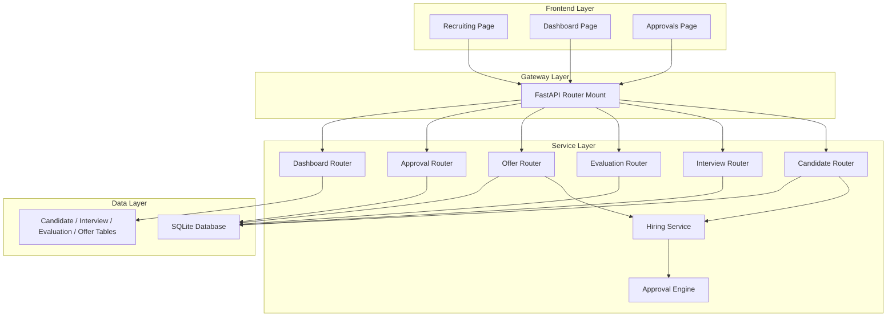
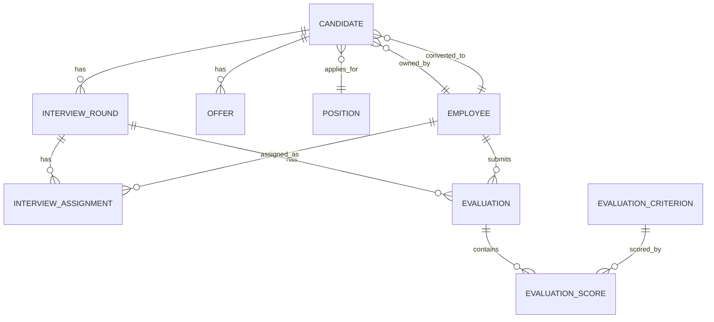
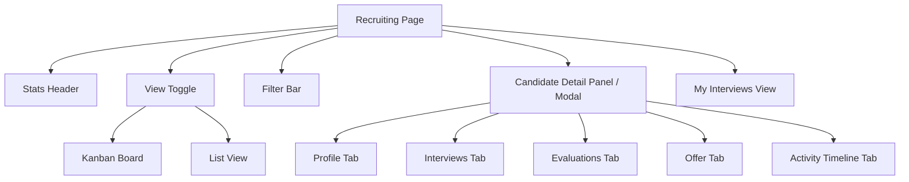

# Architecture Design Document — Recruiting Interview and Hiring Management

## Document Control

| Version | Date | Author | Description |
|---------|------|--------|-------------|
| 1.0 | 2026-04-27 | CoStrict | Initial architecture design |

---

## 1. Architecture Overview

### 1.1 Architecture Goals

* **Scalability**: The module is designed as a set of cohesive router + model extensions within the existing monolithic FastAPI backend. The entity model cleanly separates concerns so that future extraction into dedicated services is possible without data-layer rework.
* **High Availability**: The module relies on the existing single-node SQLite + FastAPI runtime. No new infrastructure dependencies are introduced.
* **Maintainability**: All new entities follow the existing SQLAlchemy declarative pattern, Pydantic v2 schema conventions, and semantic CSS design system. Business logic is isolated into dedicated service modules to keep routers thin.

### 1.2 Architecture Principles

* **Single Responsibility Principle**: Each router handles one domain entity; business rules live in service modules.
* **Open/Closed Principle**: The existing `Candidate` model and `Recruiting.tsx` page are extended, not replaced.
* **Dependency Inversion Principle**: The hiring workflow depends on the generic approval engine abstraction, not on implementation details of leave or salary approvals.

---

## 2. System Architecture

### 2.1 Overall Architecture Diagram



### 2.2 Architecture Layers

#### 2.2.1 Presentation Layer

* **Web Application**: React 18 + TypeScript + Vite. The existing `Recruiting.tsx` page is restructured into a composite page with sub-components. The custom semantic CSS design system in `index.css` is reused for all new UI elements.

#### 2.2.2 Business Layer

* **Monolithic FastAPI Application**: New routers are added alongside existing ones. Business logic that spans multiple entities (e.g., hiring workflow, candidate-to-employee conversion) is placed in a dedicated `hiring_service.py` module under `backend/services/`.

#### 2.2.3 Data Layer

* **Primary Database**: SQLite via SQLAlchemy ORM. New tables are created for interview rounds, interviewer assignments, evaluation criteria, evaluations, evaluation scores, and offers.
* **Migration Strategy**: SQLite schema changes are applied via the project's custom schema upgrade mechanism on application startup.

---

## 3. Service Design

### 3.1 Service Decomposition

| Service / Router | Responsibility | Technology Stack | Database |
|------------------|----------------|------------------|----------|
| Candidate Router | CRUD for candidates; stage transitions; list/kanban data | FastAPI + SQLAlchemy | candidates table |
| Interview Router | CRUD for interview rounds and interviewer assignments | FastAPI + SQLAlchemy | interview_rounds, interview_assignments tables |
| Evaluation Router | CRUD for evaluation criteria, evaluations, and scores | FastAPI + SQLAlchemy | evaluation_criteria, evaluations, evaluation_scores tables |
| Offer Router | CRUD for offers; status transitions | FastAPI + SQLAlchemy | offers table |
| Hiring Service | Business logic for hire proposals, stage validation, candidate-to-employee conversion, score aggregation | Python service module | All recruiting tables + employees + approval_flows |
| Approval Router | Reused as-is; extended to support `hire_proposal` type | FastAPI + SQLAlchemy | approval_flows, approval_records |

### 3.2 Inter-Service Communication

#### 3.2.1 Synchronous Communication

* **Protocol**: HTTP REST via FastAPI routers.
* **Pattern**: Routers call service-layer functions directly within the same process. No external service calls are required.

#### 3.2.2 Asynchronous Communication

* Not applicable for this module within the existing monolith. All operations are synchronous request/response.

### 3.3 API Design

#### 3.3.1 Candidate Endpoints

* **URL**: `/api/candidates`
* **Method**: `GET`
* **Description**: List candidates with filtering, sorting, and pagination.
* **Query Parameters**:
  * `search`: string — name, email, or phone search
  * `stage`: string — single stage filter
  * `stages`: string — comma-separated multi-select stage filter
  * `position_id`: integer
  * `owner_id`: integer
  * `source`: string
  * `sort_by`: string — one of `name`, `stage`, `position_id`, `source`, `owner_id`, `created_at`
  * `sort_order`: string — `asc` or `desc`
  * `page`: integer
  * `page_size`: integer
* **Response Format**:
  ```json
  {
    "total": 0,
    "items": []
  }
  ```

* **URL**: `/api/candidates/{id}`
* **Method**: `GET`
* **Description**: Get candidate detail including position title, owner name, interview history summary, latest evaluation aggregate, and offer summary.

* **URL**: `/api/candidates/{id}/stage`
* **Method**: `PUT`
* **Description**: Update candidate stage with transition validation.
* **Request Body**:
  ```json
  {
    "stage": "string",
    "reason": "string"
  }
  ```

* **URL**: `/api/candidates/{id}/convert`
* **Method**: `POST`
* **Description**: Convert a hired candidate to an employee record.
* **Response**: Newly created employee object.

#### 3.3.2 Interview Round Endpoints

* **URL**: `/api/candidates/{candidate_id}/interviews`
* **Method**: `GET`
* **Description**: List all interview rounds for a candidate.

* **URL**: `/api/candidates/{candidate_id}/interviews`
* **Method**: `POST`
* **Description**: Create a new interview round.
* **Request Body**:
  ```json
  {
    "title": "string",
    "scheduled_date": "date",
    "start_time": "time",
    "end_time": "time",
    "mode": "online|onsite|phone",
    "location": "string",
    "interviewer_ids": [1, 2]
  }
  ```

* **URL**: `/api/interviews/{id}`
* **Method**: `PUT`
* **Description**: Update an interview round.

* **URL**: `/api/interviews/{id}`
* **Method**: `DELETE`
* **Description**: Delete an interview round.

* **URL**: `/api/interviews/{id}/status`
* **Method**: `PUT`
* **Description**: Update round status (scheduled, in_progress, completed, cancelled).

* **URL**: `/api/interviews/my`
* **Method**: `GET`
* **Description**: List interview rounds where the current user is assigned as an interviewer.

#### 3.3.3 Evaluation Endpoints

* **URL**: `/api/evaluation-criteria`
* **Method**: `GET`
* **Description**: List all active evaluation criteria.

* **URL**: `/api/evaluation-criteria`
* **Method**: `POST`
* **Description**: Create a new evaluation criterion (HR only).

* **URL**: `/api/evaluation-criteria/{id}`
* **Method**: `PUT`
* **Description**: Update an evaluation criterion.

* **URL**: `/api/evaluation-criteria/{id}`
* **Method**: `DELETE`
* **Description**: Soft-delete or deactivate an evaluation criterion.

* **URL**: `/api/interviews/{interview_id}/evaluations`
* **Method**: `GET`
* **Description**: List evaluations for an interview round.

* **URL**: `/api/interviews/{interview_id}/evaluations`
* **Method**: `POST`
* **Description**: Submit an evaluation for a completed round.
* **Request Body**:
  ```json
  {
    "scores": [
      { "criterion_id": 1, "score": 5 }
    ],
    "feedback": "string"
  }
  ```

#### 3.3.4 Offer Endpoints

* **URL**: `/api/candidates/{candidate_id}/offers`
* **Method**: `GET`
* **Description**: List offers for a candidate.

* **URL**: `/api/candidates/{candidate_id}/offers`
* **Method**: `POST`
* **Description**: Create an offer for a candidate.
* **Request Body**:
  ```json
  {
    "base_salary": 0,
    "bonus": 0,
    "proposed_start_date": "date",
    "employment_type": "full_time|contractor|intern",
    "work_location": "string",
    "notes": "string"
  }
  ```

* **URL**: `/api/offers/{id}`
* **Method**: `PUT`
* **Description**: Update an offer.

* **URL**: `/api/offers/{id}/status`
* **Method**: `PUT`
* **Description**: Update offer status. Certain transitions trigger candidate stage updates.

#### 3.3.5 Dashboard Endpoints

* **URL**: `/api/dashboard/stats`
* **Method**: `GET`
* **Description**: Extended to include recruiting metrics in addition to existing HR metrics.
* **Additional Fields in Response**:
  ```json
  {
    "total_active_candidates": 0,
    "candidates_by_stage": {},
    "avg_days_in_stage": 0,
    "upcoming_interviews_count": 0,
    "pending_evaluations_count": 0,
    "pending_hire_proposals_count": 0,
    "offer_acceptance_rate": 0
  }
  ```

---

## 4. Data Architecture

### 4.1 Data Storage Strategy

* **Relational Database (SQLite)**: All new entities use SQLAlchemy declarative models with standard integer primary keys and foreign key relationships. This maintains consistency with the existing ORM approach.
* **JSON Columns**: The existing `ApprovalFlow.content` field (JSON type) is reused to store hire-proposal-specific metadata such as `candidate_id`, `position_id`, and `proposed_hire_date`.

### 4.2 Entity Relationship Diagram



### 4.3 New and Extended Models

#### 4.3.1 Candidate (Extended)

* **New columns**:
  * `employee_id`: ForeignKey to `employees.id`, nullable. Set after candidate-to-employee conversion.
  * `current_stage_entered_at`: DateTime. Automatically updated when `stage` changes.
  * `rejection_reason`: Text, nullable. Required when stage becomes `rejected` or `withdrawn`.
* **Stage values**: `new`, `screening`, `phone_interview`, `onsite_interview`, `evaluation`, `offer_pending`, `offer_sent`, `offer_accepted`, `hired`, `rejected`, `withdrawn`.
* **Migration note**: Existing records with `interview` map to `onsite_interview`; `offer` maps to `offer_pending`.

#### 4.3.2 InterviewRound (New)

* **Columns**:
  * `id`: Primary key
  * `candidate_id`: ForeignKey to `candidates.id`, non-nullable
  * `title`: String, non-nullable
  * `scheduled_date`: Date, non-nullable
  * `start_time`: Time, non-nullable
  * `end_time`: Time, non-nullable
  * `mode`: String — one of `online`, `onsite`, `phone`
  * `location`: String, nullable
  * `status`: String — one of `scheduled`, `in_progress`, `completed`, `cancelled`
  * `created_at`, `updated_at`: DateTime

#### 4.3.3 InterviewAssignment (New)

* **Columns**:
  * `id`: Primary key
  * `interview_round_id`: ForeignKey to `interview_rounds.id`
  * `employee_id`: ForeignKey to `employees.id`
* **Unique constraint**: (`interview_round_id`, `employee_id`) to prevent duplicate assignments.

#### 4.3.4 EvaluationCriterion (New)

* **Columns**:
  * `id`: Primary key
  * `name`: String, non-nullable
  * `description`: Text, nullable
  * `weight`: Float, default 1.0
  * `sort_order`: Integer, default 0
  * `is_active`: Boolean, default True

#### 4.3.5 Evaluation (New)

* **Columns**:
  * `id`: Primary key
  * `interview_round_id`: ForeignKey to `interview_rounds.id`
  * `interviewer_id`: ForeignKey to `employees.id`
  * `feedback`: Text, nullable
  * `submitted_at`: DateTime
* **Unique constraint**: (`interview_round_id`, `interviewer_id`) — one evaluation per interviewer per round.

#### 4.3.6 EvaluationScore (New)

* **Columns**:
  * `id`: Primary key
  * `evaluation_id`: ForeignKey to `evaluations.id`
  * `criterion_id`: ForeignKey to `evaluation_criteria.id`
  * `score`: Integer — range 1 to 5

#### 4.3.7 Offer (New)

* **Columns**:
  * `id`: Primary key
  * `candidate_id`: ForeignKey to `candidates.id`
  * `position_id`: ForeignKey to `positions.id`
  * `base_salary`: Float
  * `bonus`: Float, default 0
  * `proposed_start_date`: Date
  * `employment_type`: String — one of `full_time`, `contractor`, `intern`
  * `work_location`: String, nullable
  * `status`: String — one of `draft`, `pending_approval`, `approved`, `sent`, `accepted`, `rejected`, `withdrawn`
  * `sent_at`: DateTime, nullable
  * `responded_at`: DateTime, nullable
  * `notes`: Text, nullable
  * `created_at`, `updated_at`: DateTime

### 4.4 Data Consistency

* **Strong consistency**: All CRUD operations on candidates, interviews, evaluations, and offers use standard SQLAlchemy transactions with immediate commit. The SQLite database provides ACID guarantees within a single request.
* **Eventual consistency**: Not applicable; all operations are synchronous.

---

## 5. Frontend Architecture

### 5.1 Page Structure

The existing `Recruiting.tsx` page is restructured into a composite page with view-mode switching and sub-routes or conditional panels.



### 5.2 Component Responsibilities

| Component | Responsibility |
|-----------|----------------|
| Recruiting Page | Orchestrates data loading, view mode state, filter state, and modal visibility. |
| Stats Header | Displays metric cards for candidate counts by stage, upcoming interviews, pending evaluations. |
| View Toggle | Switches between kanban and list view. |
| Kanban Board | Renders columns per stage; cards are clickable to open detail. |
| List View | Data table with sortable columns and multi-select filters. |
| Filter Bar | Global filters for stage, position, source, owner; includes "My Interviews" toggle. |
| Candidate Detail | Tabbed panel/modal showing profile, interviews, evaluations, offer, and timeline. |
| Interview Schedule Form | Modal for creating/editing interview rounds with interviewer multi-select. |
| Evaluation Form | Scored criteria form with 1–5 inputs and feedback textarea. |
| Offer Form | Create/edit offer with salary, start date, employment type, and work location. |
| Activity Timeline | Chronological list of stage changes, interview events, evaluation submissions, and offer events. |

### 5.3 State Management

* **Local Component State**: React `useState` and `useCallback` for form inputs, modal visibility, view mode, and filters. This follows the existing pattern in `Recruiting.tsx`.
* **Global State (Zustand)**: The existing `appStore.ts` continues to manage `currentRole`. No new global stores are required; data is fetched via API on mount and after mutations.
* **Server State**: API calls are made directly from components using the existing `frontend/src/api/index.ts` pattern. New API functions are added for interviews, evaluations, offers, and extended candidate operations.

### 5.4 Localization

* All new UI labels are added to `frontend/src/locales/zh.json` and `frontend/src/locales/en.json`.
* Chinese remains the default language as configured in `frontend/src/i18n.ts`.

---

## 6. Integration Points

### 6.1 Approval Engine Integration

* **Reuse**: The existing `ApprovalFlow` model and `approval_engine.py` state machine are reused without modification.
* **Extension**: The `approvals.py` router is extended to accept `hire_proposal` as a valid `flow_type` in `_validate_content`.
* **Hire Proposal Flow**:
  1. Hiring Manager initiates a hire proposal via the candidate detail UI.
  2. The frontend calls `POST /api/approvals` with `type: hire_proposal` and `content` containing `candidate_id`, `position_id`, `proposed_hire_date`.
  3. The approval engine routes the flow: `draft → pending_manager → pending_hr → approved|rejected`.
  4. On final approval, the `Hiring Service` updates the candidate stage to `hired`.
  5. On rejection, the `Hiring Service` reverts the candidate stage to `evaluation` and stores the rejection comment.

### 6.2 Employee Module Integration

* **Conversion Flow**:
  1. When a candidate is in `hired` stage and has an accepted offer, HR triggers `POST /api/candidates/{id}/convert`.
  2. The `Hiring Service` creates a new `Employee` record using candidate data:
     * `name`, `email`, `phone` copied from candidate
     * `position_id` and `department_id` derived from the candidate's position
     * `hire_date` set to the offer's `proposed_start_date`
     * `employee_no` auto-generated via the same logic as `employees.py`
     * `status` set to `active`, `role` set to `employee`
  3. The candidate's `employee_id` is updated with the new employee's ID.
  4. The frontend redirects to the employee edit page (`/employees/{new_id}`) to complete remaining fields.

### 6.3 Position Module Integration

* Offers and candidates both reference `Position` via `position_id`.
* Offer creation validates that the candidate's `position_id` is valid.
* Candidate-to-employee conversion derives `department_id` from the position's `department_id`.

### 6.4 Dashboard Integration

* The `dashboard.py` router is extended to compute recruiting metrics from candidate, interview, evaluation, and offer tables.
* New metrics are appended to the existing `DashboardStats` schema.

---

## 7. Business Logic Modules

### 7.1 Stage Transition Validator

* **Location**: `backend/services/hiring_service.py`
* **Responsibilities**:
  * Define the valid forward transition chain: `new → screening → phone_interview → onsite_interview → evaluation → offer_pending → offer_sent → offer_accepted → hired`.
  * Allow `rejected` and `withdrawn` from any stage except `hired`.
  * Block transitions to `hired` unless all interview rounds are `completed` and at least one evaluation exists.
  * Require `rejection_reason` when transitioning to `rejected` or `withdrawn`.
  * Update `current_stage_entered_at` on every valid stage change.

### 7.2 Interview Conflict Checker

* **Location**: `backend/services/hiring_service.py`
* **Responsibilities**:
  * Prevent creation or update of interview rounds that overlap in time for the same candidate.
  * Overlap is defined as: same `candidate_id` and `scheduled_date`, where time ranges intersect.

### 7.3 Score Aggregator

* **Location**: `backend/services/hiring_service.py`
* **Responsibilities**:
  * For a single evaluation, compute the weighted average score across all criteria using `EvaluationCriterion.weight`.
  * For a single interview round, compute the round average as the mean of all interviewer weighted averages.
  * For a candidate, compute the overall score as the mean of all completed round averages.
  * Expose helper functions used by the candidate detail endpoint.

### 7.4 Offer State Coordinator

* **Location**: `backend/services/hiring_service.py`
* **Responsibilities**:
  * Enforce that offer creation is only allowed when candidate stage is `evaluation` or later.
  * Enforce that an offer must be `approved` before it can be marked `sent`.
  * On offer `accepted`, auto-transition candidate stage to `offer_accepted`.
  * On offer `rejected`, auto-transition candidate stage to `rejected` and require a reason.

### 7.5 Hire Proposal Side Effect Handler

* **Location**: `backend/services/hiring_service.py` (called from approval side effects or router)
* **Responsibilities**:
  * On approval flow final `approved` state for `hire_proposal` type:
    * Update linked candidate stage to `hired`.
    * Update linked offer status to `approved` if applicable.
  * On approval flow `rejected` state:
    * Revert candidate stage to `evaluation`.
    * Store the rejection comment on the candidate record.

---

## 8. Security and Permissions

### 8.1 Role-Based Access Control

| Action | HR | Hiring Manager | Interviewer |
|--------|-----|----------------|-------------|
| View all candidates | Yes | Yes (own positions) | No |
| Create/edit/delete candidates | Yes | No | No |
| Manage interview rounds | Yes | Yes (own positions) | No |
| Submit evaluations | Yes | Yes | Yes (own assignments) |
| View all evaluations | Yes | Yes | No (own only) |
| Create/edit offers | Yes | No | No |
| Approve hire proposal | Yes (as HR step) | Yes (as manager step) | No |
| Convert to employee | Yes | No | No |

* **Backend enforcement**: Routers check the requester's role via the existing mechanism. The approvals router already enforces manager-then-HR role checks.
* **Frontend enforcement**: UI controls are conditionally rendered based on `useAppStore().currentRole`. This is cosmetic only; backend is the authoritative gate.

---

## 9. Design Decisions and Rationale

| Decision | Rationale |
|----------|-----------|
| Extend `Candidate` model in-place rather than create a new entity | Minimizes migration complexity; existing kanban board and CRUD remain functional with incremental additions. |
| Reuse `ApprovalFlow` for hire proposals | Avoids building a parallel approval system; leverages the hardcoded state machine and existing UI. |
| Store hire-proposal metadata in `ApprovalFlow.content` JSON | Keeps the approval engine generic; no schema changes needed to `approval_flows`. |
| Single `hiring_service.py` module for cross-cutting business logic | Keeps routers thin and testable; centralizes rules that span candidates, interviews, evaluations, offers, and approvals. |
| Use existing semantic CSS classes | Maintains visual consistency with the rest of the HRMS; no new styling abstractions needed. |
| Candidate-to-employee conversion creates Employee but keeps Candidate | Preserves audit trail and recruiting history; links via `candidate.employee_id`. |
| Evaluation criteria are global, not per-position | Simplifies the initial implementation; HR configures criteria once for the organization. |

---

## 10. Traceability to Requirements

| Requirement ID | Design Coverage |
|----------------|-----------------|
| FR-001 | Candidate model extended with new columns and stage values; migration logic specified. |
| FR-002 | List view with sorting and multi-select filters designed in frontend component structure and API query parameters. |
| FR-003 | Candidate detail view with tabbed panels for profile, interviews, evaluations, offer, and timeline. |
| FR-004 | InterviewRound model and CRUD endpoints; overlap validation in hiring service. |
| FR-005 | Timeline/calendar section in frontend with day/week/candidate filters. |
| FR-006 | InterviewAssignment model; "My Interviews" filter and permission rules. |
| FR-007 | EvaluationCriterion, Evaluation, EvaluationScore models and submission endpoint. |
| FR-008 | Score aggregator logic; per-round and overall averages in candidate detail. |
| FR-009 | Stage transition validator in hiring service. |
| FR-010 | Hire proposal via ApprovalFlow with `hire_proposal` type; side effect handler updates candidate stage. |
| FR-011 | Offer model and CRUD endpoints; status coordination rules. |
| FR-012 | Offer state coordinator auto-transitions candidate stage on accept/reject. |
| FR-013 | Candidate-to-employee conversion endpoint and creation logic in hiring service. |
| FR-014 | Dashboard router and schema extended with recruiting metrics. |

---

*End of Document*
