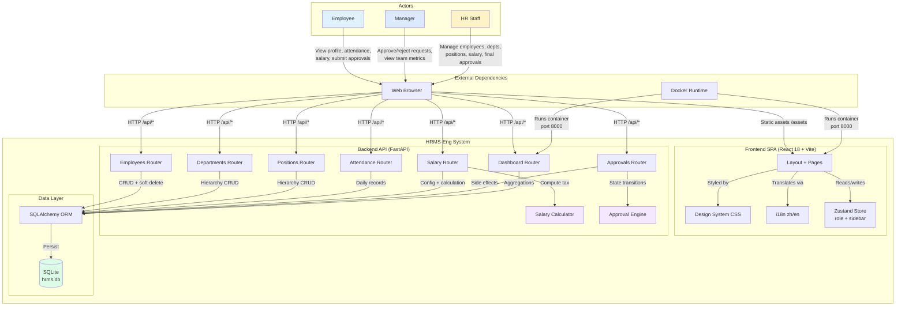
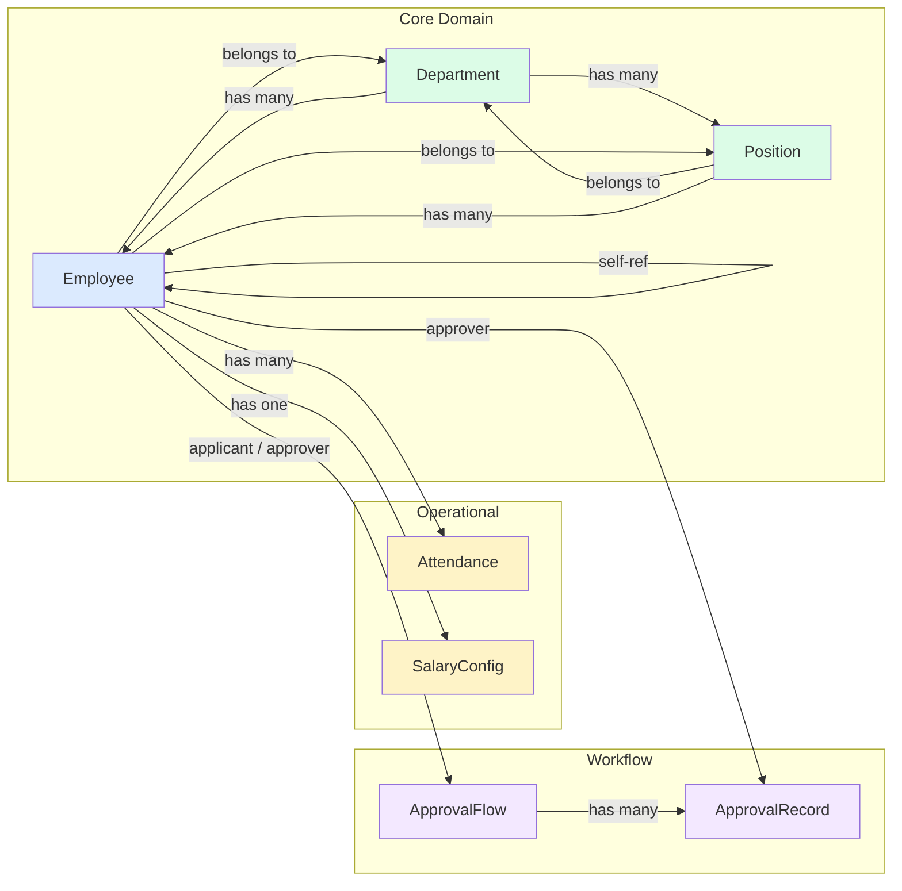

# 01 Product Goals and Background

<details>
<summary>Related Source Files</summary>

- [`backend/main.py`](backend/main.py)
- [`backend/models.py`](backend/models.py)
- [`backend/schemas.py`](backend/schemas.py)
- [`backend/seed.py`](backend/seed.py)
- [`backend/database.py`](backend/database.py)
- [`backend/routers/employees.py`](backend/routers/employees.py)
- [`backend/routers/approvals.py`](backend/routers/approvals.py)
- [`backend/routers/dashboard.py`](backend/routers/dashboard.py)
- [`backend/routers/salary.py`](backend/routers/salary.py)
- [`backend/services/approval_engine.py`](backend/services/approval_engine.py)
- [`backend/services/salary_calculator.py`](backend/services/salary_calculator.py)
- [`frontend/src/App.tsx`](frontend/src/App.tsx)
- [`frontend/src/pages/Dashboard.tsx`](frontend/src/pages/Dashboard.tsx)
- [`frontend/src/pages/Employees.tsx`](frontend/src/pages/Employees.tsx)
- [`frontend/src/pages/Departments.tsx`](frontend/src/pages/Departments.tsx)
- [`frontend/src/pages/Attendance.tsx`](frontend/src/pages/Attendance.tsx)
- [`frontend/src/pages/Salary.tsx`](frontend/src/pages/Salary.tsx)
- [`frontend/src/pages/Approvals.tsx`](frontend/src/pages/Approvals.tsx)
- [`frontend/src/components/Layout.tsx`](frontend/src/components/Layout.tsx)
- [`frontend/src/stores/appStore.ts`](frontend/src/stores/appStore.ts)
- [`frontend/src/i18n.ts`](frontend/src/i18n.ts)
- [`frontend/src/api/index.ts`](frontend/src/api/index.ts)
- [`frontend/src/index.css`](frontend/src/index.css)
- [`frontend/package.json`](frontend/package.json)
- [`Dockerfile`](Dockerfile)
- [`docker-compose.yml`](docker-compose.yml)
- [`hrms`](hrms)

</details>

## Overview

HRMS-Eng is a full-stack Human Resource Management System built to manage the employee lifecycle, organizational hierarchy, attendance tracking, compensation, and internal approval workflows for small-to-medium enterprises. The application provides a unified web interface for three user groups—employees, managers, and HR administrators—to view and act on people-related data.

The backend is implemented in Python with FastAPI, SQLAlchemy ORM, and Pydantic v2, persisting data to SQLite. The frontend is a React 18 SPA built with Vite 6, TypeScript, Tailwind CSS v4, and Zustand for state management. The entire application is packaged as a single Docker container that serves both the REST API and the built frontend assets on port 8000.

This document establishes the product positioning of HRMS-Eng, describes the seven core business capabilities, defines what is in and out of scope, and documents the key constraints and assumptions baked into the codebase.

## Product Positioning and Value

### Target Problem

HRMS-Eng addresses the operational challenge of maintaining accurate, up-to-date employee records and HR processes without relying on spreadsheets or disjointed tools. Specifically, it solves:

- **Fragmented employee data**: Employee profiles, department assignments, position hierarchies, and manager relationships are stored in a single relational database ([`backend/models.py`](backend/models.py)) rather than scattered across files.
- **Manual attendance tracking**: Daily check-in/check-out records are persisted with status classification (normal, late, absent, leave) and aggregated into monthly rates ([`backend/routers/attendance.py`](backend/routers/attendance.py)).
- **Error-prone salary calculations**: The system automates China mainland individual income tax computation using progressive tax brackets, plus social insurance and housing fund deductions ([`backend/services/salary_calculator.py`](backend/services/salary_calculator.py)).
- **Opaque approval processes**: Leave requests, salary adjustments, and other applications flow through a defined multi-level approval state machine (draft → pending_manager → pending_hr → approved/rejected) with automatic side effects ([`backend/services/approval_engine.py`](backend/services/approval_engine.py), [`backend/routers/approvals.py`](backend/routers/approvals.py)).

### Value Proposition by User Group

| User Group | Primary Goals | Value Delivered |
|---|---|---|
| **Employee** | View personal profile, check attendance, view salary config, submit approval requests | Self-service access to personal HR data; transparent approval status tracking |
| **Manager** | Review and approve/reject subordinate requests; view team and department metrics | Structured approval queue; dashboard visibility into team attendance and pending items |
| **HR Staff** | Onboard employees, manage departments and positions, process final approvals, calculate salaries | Centralized admin interface; automated tax calculation; soft-delete retention of historical records |

### Evidence of Intended Scope

The [`backend/seed.py`](backend/seed.py) file seeds realistic enterprise demo data on startup, indicating the intended scale and organizational complexity:

- **8 departments**: 总裁办公室, 人力资源部, 财务管理部, 产品管理部, 技术研发部, 客户成功部, 市场销售部, 行政采购部
- **30+ positions** across departments with level designations (P3–P8, M1–M3)
- **64+ employees** in the initial seed, with automatic expansion to a target of 64+ active records
- Realistic attributes: employee numbers, email domains, phone numbers, work locations, employment types, hire dates, contract end dates, emergency contacts, and salary configurations

This seed data demonstrates that HRMS-Eng is designed for a multi-department enterprise with hierarchical reporting, not a micro-team or single-user tool.

### Contrast with Generic HR Tools

Unlike generic SaaS HR platforms, HRMS-Eng:
- Is **self-hosted** via Docker with a single-container deployment model
- Uses **China mainland tax rules** hardcoded into the salary calculator
- Provides **client-side role switching** for rapid demo and testing without SSO integration
- Implements a **custom semantic CSS design system** ([`frontend/src/index.css`](frontend/src/index.css)) alongside Tailwind utilities for a branded, consistent UI

## Core Capabilities Overview

HRMS-Eng delivers seven business capabilities, each mapped to backend routers and frontend pages.

### 1. Dashboard Analytics

**Problem solved**: HR staff and managers need at-a-glance visibility into workforce metrics without running manual reports.

**Observable behavior**: The Dashboard page ([`frontend/src/pages/Dashboard.tsx`](frontend/src/pages/Dashboard.tsx)) displays:
- Active/inactive employee counts
- Monthly attendance rate and abnormal attendance count
- Pending approvals count
- Department and position counts
- Contracts expiring in 30 and 60 days
- Salary configuration coverage percentage
- Department headcount distribution with visual bars
- Recent approval flows table

**Implementation**: [`backend/routers/dashboard.py`](backend/routers/dashboard.py) aggregates counts and rates from the `Employee`, `Attendance`, `ApprovalFlow`, `Department`, `Position`, and `SalaryConfig` models, returning a `DashboardStats` Pydantic schema.

**Acceptance signal**: `GET /api/dashboard/stats` returns non-zero counts after seeding, and the Dashboard page renders metric cards without empty states.

### 2. Employee Management

**Problem solved**: Organizations need a central source of truth for employee profiles, reporting lines, and employment status.

**Observable behavior**: The Employees page supports searching by name, employee number, email, or phone; filtering by department, position, status, and employment type; paginated listing; and full CRUD operations.

**Implementation**: [`backend/routers/employees.py`](backend/routers/employees.py) provides:
- `GET /api/employees` with search, filter, and pagination
- `GET /api/employees/{id}` for single record retrieval
- `POST /api/employees` for creation with auto-generated employee numbers
- `PUT /api/employees/{id}` for updates with validation (unique employee number, department/position/manager existence, self-management prevention)
- `DELETE /api/employees/{id}` performs a **soft-delete** by setting `status = "inactive"`

The `_to_out` helper enriches employee records with `department_name`, `position_title`, `manager_name`, `base_salary`, and `recent_attendance_status`.

**Acceptance signal**: Creating an employee returns a record with an auto-generated `EMPXXXX` number; deleting an employee returns `{"ok": true, "status": "inactive"}` and the record remains queryable.

### 3. Department and Position Hierarchy

**Problem solved**: Organizations need to model reporting structures, department headcount plans, and position levels.

**Observable behavior**: The Departments page ([`frontend/src/pages/Departments.tsx`](frontend/src/pages/Departments.tsx)) shows department cards with manager, employee count, and headcount plan. Positions are managed within departments with level and description fields.

**Implementation**: [`backend/routers/departments.py`](backend/routers/departments.py) and [`backend/routers/positions.py`](backend/routers/positions.py) provide CRUD endpoints. The `Department` model ([`backend/models.py:7`](backend/models.py:7)) has a self-referential `manager_id` foreign key and `headcount_plan`. The `Position` model ([`backend/models.py:22`](backend/models.py:22)) links to `Department` via `department_id`.

**Acceptance signal**: Departments list returns `employee_count` computed from active employees; positions cannot be deleted if employees are still assigned.

### 4. Attendance Tracking

**Problem solved**: HR needs daily visibility into who is present, late, absent, or on leave.

**Observable behavior**: The Attendance page records daily check-in/check-out times and classifies status. Monthly statistics show normal, late, absent, and leave day counts.

**Implementation**: [`backend/routers/attendance.py`](backend/routers/attendance.py) manages `Attendance` records linked to `Employee`. The seed script generates realistic attendance data with weighted random statuses (normal 82–84%, late 7–8%, absent 4%, leave 5–6%).

**Acceptance signal**: `GET /api/attendance/stats` returns aggregated monthly rates matching the seeded records.

### 5. Salary Calculation with China Mainland Tax Rules

**Problem solved**: Manual salary calculation is error-prone, especially with progressive tax brackets and social deductions.

**Observable behavior**: The Salary page ([`frontend/src/pages/Salary.tsx`](frontend/src/pages/Salary.tsx)) allows selecting an employee, viewing their salary configuration, adjusting parameters, and running a calculation that produces a detailed pay slip.

**Implementation**: [`backend/services/salary_calculator.py`](backend/services/salary_calculator.py) implements:
- `TAX_THRESHOLD = 5000` (个税起征点)
- 7 progressive tax brackets from 3% to 45%
- Social insurance (default 10.5%) and housing fund (default 12%) deductions
- Formula: `taxable_income = gross_salary - social_insurance - housing_fund - TAX_THRESHOLD`

The tax bracket table is:

| Upper Bound (CNY) | Rate | Quick Deduction |
|---|---|---|
| 3,000 | 3% | 0 |
| 12,000 | 10% | 210 |
| 25,000 | 20% | 1,410 |
| 35,000 | 25% | 2,660 |
| 55,000 | 30% | 4,410 |
| 80,000 | 35% | 7,160 |
| ∞ | 45% | 15,160 |

**Acceptance signal**: `POST /api/salary/calculate` with a base salary of 15,000 returns a result where `income_tax` matches the progressive bracket calculation, and `net_salary` equals gross minus all deductions.

### 6. Multi-Level Approval Workflows

**Problem solved**: Organizations need structured routing for leave requests, salary adjustments, and other applications.

**Observable behavior**: The Approvals page ([`frontend/src/pages/Approvals.tsx`](frontend/src/pages/Approvals.tsx)) supports creating applications, viewing queues by role (my applications, pending my approval, all), and approving/rejecting with comments.

**Implementation**: [`backend/services/approval_engine.py`](backend/services/approval_engine.py) defines the state machine:

```python
VALID_TRANSITIONS = {
    "draft": {"submit": "pending_manager"},
    "pending_manager": {"approve": "pending_hr", "reject": "rejected"},
    "pending_hr": {"approve": "approved", "reject": "rejected"},
    "approved": {},
    "rejected": {},
}
```

[`backend/routers/approvals.py`](backend/routers/approvals.py) enforces role checks: only managers can approve `pending_manager` flows, and only HR can approve `pending_hr` flows. Side effects are applied on final approval:
- **Leave approvals**: create/update `Attendance` records with `status = "leave"` for the requested date range
- **Salary adjustments**: update the applicant's `SalaryConfig.base_salary`

**Acceptance signal**: Creating a leave approval, having it approved by manager then HR, results in new `Attendance` records with `status = "leave"` for the requested dates.

### 7. Bilingual UI (Chinese / English)

**Problem solved**: The application must support both Chinese-speaking HR staff and English-speaking users in a mixed-language environment.

**Observable behavior**: All UI text is localized. The Layout component provides a language switcher dropdown. Chinese is the default language.

**Implementation**: [`frontend/src/i18n.ts`](frontend/src/i18n.ts) initializes `react-i18next` with `zh` as the default and fallback language. Translation resources live in [`frontend/src/locales/zh.json`](frontend/src/locales/zh.json) and [`frontend/src/locales/en.json`](frontend/src/locales/en.json).

**Acceptance signal**: Switching the language in the UI header updates all labels immediately without page reload.

## Scope and Non-Goals

### What Is Implemented

Based on observable code, the following capabilities are in scope:

| Capability | Evidence |
|---|---|
| Employee CRUD with soft-delete | [`backend/routers/employees.py:146-153`](backend/routers/employees.py:146) |
| Department and position hierarchy | [`backend/routers/departments.py`](backend/routers/departments.py), [`backend/routers/positions.py`](backend/routers/positions.py) |
| Attendance recording and monthly stats | [`backend/routers/attendance.py`](backend/routers/attendance.py) |
| Salary configuration and China tax calculation | [`backend/routers/salary.py`](backend/routers/salary.py), [`backend/services/salary_calculator.py`](backend/services/salary_calculator.py) |
| Multi-level approval workflows (leave, salary_adjust, other) | [`backend/routers/approvals.py`](backend/routers/approvals.py), [`backend/services/approval_engine.py`](backend/services/approval_engine.py) |
| Dashboard analytics with aggregations | [`backend/routers/dashboard.py`](backend/routers/dashboard.py) |
| Bilingual UI (Chinese default, English secondary) | [`frontend/src/i18n.ts`](frontend/src/i18n.ts), [`frontend/src/locales/`](frontend/src/locales/) |
| Dockerized single-container deployment | [`Dockerfile`](Dockerfile), [`docker-compose.yml`](docker-compose.yml) |
| Auto-seeding with enterprise demo data | [`backend/seed.py`](backend/seed.py), called from [`backend/main.py:16`](backend/main.py:16) |
| Schema evolution for SQLite | [`backend/database.py:26-59`](backend/database.py:26) |
| Dual test suites (pytest + Vitest) | [`run-tests.sh`](run-tests.sh), [`backend/tests/`](backend/tests/), [`frontend/src/**/__tests__/`](frontend/src/) |

### What Is Explicitly Not Implemented

| Non-Goal | Evidence / Rationale |
|---|---|
| **Real authentication / SSO** | No auth middleware, no login page, no JWT or session handling. Role switching is client-side only via [`frontend/src/stores/appStore.ts`](frontend/src/stores/appStore.ts) using `localStorage`. |
| **Payroll batch processing** | Salary is calculated per-employee on-demand via `POST /api/salary/calculate`. No bulk payroll run or payslip generation endpoints exist. |
| **Advanced reporting / BI** | Dashboard provides basic aggregations only. No export to Excel/PDF, no custom report builder, no trend charts over time. |
| **Mobile app / PWA** | The frontend is a desktop-oriented SPA with a sidebar layout. No responsive mobile-optimized views or service workers. |
| **Email notifications** | No email/SMS integration. Approval status changes are visible only by polling the API. |
| **Audit logging** | No `created_by`, `updated_by`, or audit trail tables. Approval records capture approver actions but not system-wide data changes. |
| **File attachments** | No upload endpoints or storage integration for documents like contracts or certificates. |

## Project Constraints and Assumptions

### 1. SQLite as the Production Database

**Constraint**: The application uses SQLite with SQLAlchemy ORM ([`backend/database.py:8`](backend/database.py:8)), not PostgreSQL or MySQL. The engine is configured with `check_same_thread=False` to allow multi-threaded access within the single Uvicorn worker.

**Implications**:
- **Scalability**: SQLite handles single-writer concurrency well but is not suitable for high-write multi-user deployments. Concurrent writes may result in "database is locked" errors under load.
- **Operations**: No separate database service to manage, but also no built-in replication, point-in-time recovery, or connection pooling.
- **Schema evolution**: The project uses a custom `upgrade_sqlite_schema()` function ([`backend/database.py:26`](backend/database.py:26)) to add columns to existing tables, rather than a formal migration tool like Alembic.

### 2. Single-Container Deployment

**Constraint**: The [`Dockerfile`](Dockerfile) uses a multi-stage build (Node 20 for frontend, Python 3.12-slim for backend) and serves everything from one container on port 8000. FastAPI mounts the built SPA and falls back to `index.html` for client-side routing ([`backend/main.py:27-40`](backend/main.py:27)).

**Implications**:
- **Simplicity**: One artifact to build, one container to run, one port to expose.
- **Limitations**: Cannot scale frontend and backend independently. Rolling updates require restarting the entire container.

### 3. Client-Side Role Switching Without Real Authentication

**Constraint**: The frontend allows any user to switch roles (employee / manager / hr) via a `<select>` dropdown in the header ([`frontend/src/components/Layout.tsx:274-284`](frontend/src/components/Layout.tsx:274)). The selected role is stored in `localStorage` and managed by a Zustand store ([`frontend/src/stores/appStore.ts`](frontend/src/stores/appStore.ts)).

**Implications**:
- **Security**: This is purely a UI convenience for demos and testing. The backend approval router enforces real role checks ([`backend/routers/approvals.py:224-227`](backend/routers/approvals.py:224)), but other endpoints (employee list, salary config, attendance) have no access control. Anyone with network access to the API can read or modify all data.
- **Demo suitability**: Excellent for product demonstrations and internal testing; unacceptable for production without adding authentication middleware.

### 4. China Mainland Tax Rules Hardcoded

**Constraint**: The progressive tax brackets, threshold (5,000 CNY), and deduction rates are hardcoded in [`backend/services/salary_calculator.py`](backend/services/salary_calculator.py).

**Implications**:
- **Accuracy**: The calculation matches China mainland individual income tax rules as of the codebase date.
- **Maintainability**: Tax law changes require code modification and redeployment. There is no admin UI to adjust brackets or thresholds.
- **Geographic limitation**: The product is optimized for China mainland payroll; other jurisdictions would require a new calculator module.

### 5. Chinese as the Default Language

**Constraint**: [`frontend/src/i18n.ts`](frontend/src/i18n.ts) defaults to `zh` (Chinese) with `fallbackLng: 'zh'`. The demo data in [`backend/seed.py`](backend/seed.py) uses Chinese department and position names.

**Implications**:
- **Primary market**: The product is designed for Chinese-speaking HR teams.
- **English support**: All UI strings have English translations in [`frontend/src/locales/en.json`](frontend/src/locales/en.json), making the app usable for international users, but the default experience is Chinese.

### 6. Auto-Seeding on Every Startup

**Constraint**: [`backend/main.py:16`](backend/main.py:16) calls `seed()` at import time. If no data exists, it inserts 8 departments, 30+ positions, and 64 employees. If data already exists, it backfills missing fields and expands the employee count to a target of 64.

**Implications**:
- **Demo readiness**: A fresh container always has realistic data to explore.
- **Production risk**: If deployed to production without modification, seeding could overwrite or augment existing data. The `_expand_existing` logic adds employees if the count is below the target, which may be undesirable in production.

## Product Context Diagram

The following diagram shows HRMS-Eng in its product context: the three user roles, the system boundary, the seven internal modules, external dependencies, and data flows.



### Module Relationship Diagram



The diagrams above illustrate how the seven business modules connect to the underlying data model and how user interactions flow through the frontend, backend API, and persistence layer. Dashboard aggregates data from all other modules; Approval workflows create side effects in Attendance and SalaryConfig; Employee is the central hub linking to Department, Position, Attendance, and SalaryConfig.