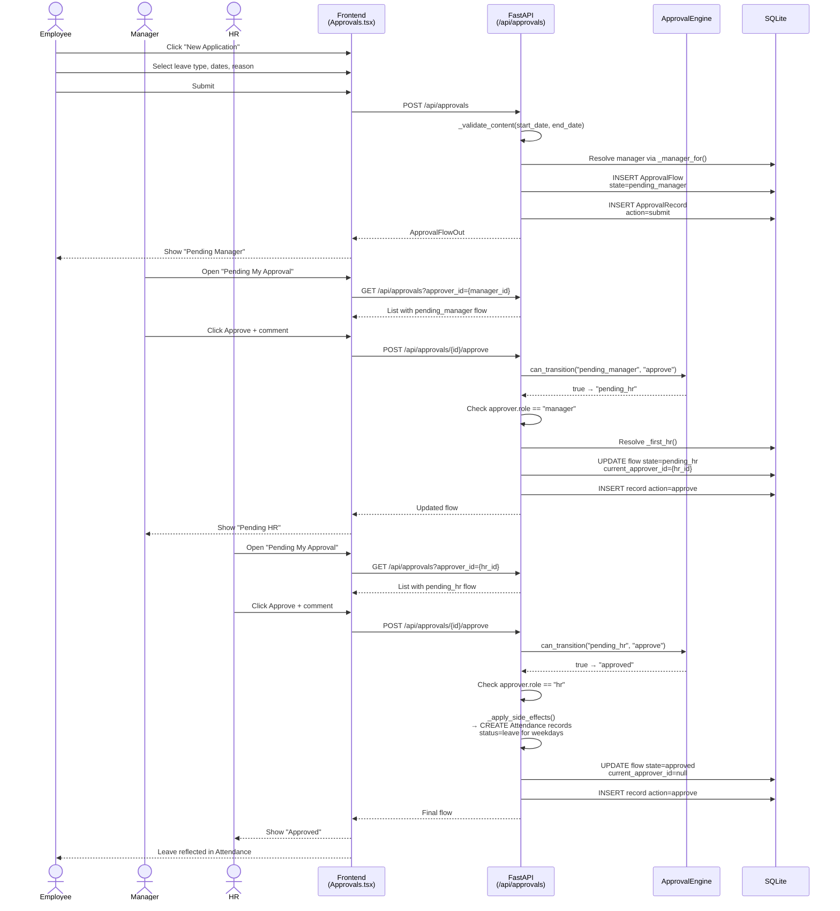
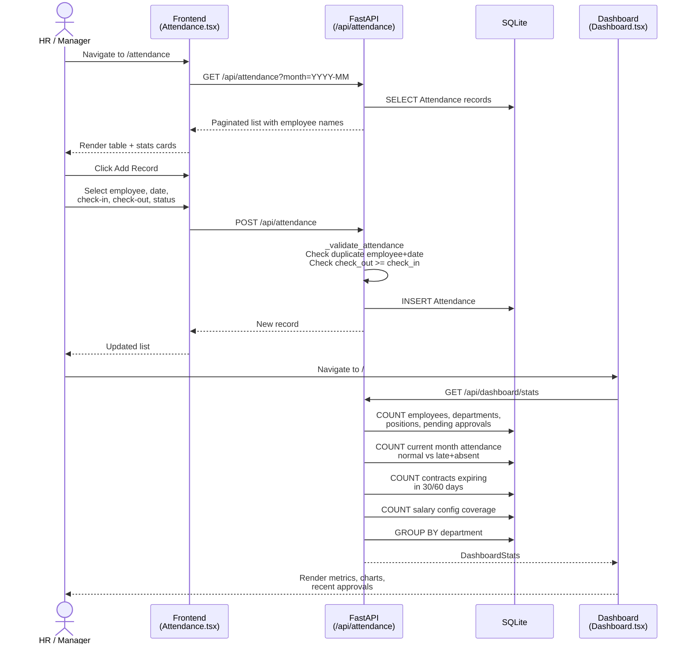

# 02 Users and Business Scenarios

<details>
<summary>Related Source Files</summary>

- `backend/models.py`
- `backend/routers/approvals.py`
- `backend/routers/employees.py`
- `backend/routers/departments.py`
- `backend/routers/positions.py`
- `backend/routers/salary.py`
- `backend/routers/attendance.py`
- `backend/routers/dashboard.py`
- `backend/services/approval_engine.py`
- `backend/services/salary_calculator.py`
- `backend/schemas.py`
- `backend/seed.py`
- `frontend/src/stores/appStore.ts`
- `frontend/src/api/index.ts`
- `frontend/src/App.tsx`
- `frontend/src/pages/Dashboard.tsx`
- `frontend/src/pages/Employees.tsx`
- `frontend/src/pages/Attendance.tsx`
- `frontend/src/pages/Salary.tsx`
- `frontend/src/pages/Approvals.tsx`
- `frontend/src/components/Layout.tsx`

</details>

## Overview

This document defines the user groups, roles, and end-to-end business scenarios that HRMS-Eng supports. The system is built around three distinct user roles—**employee**, **manager**, and **HR**—each with different goals, permissions, and interaction patterns. These roles are not just UI labels; they drive real backend behavior in the approval workflow engine, salary calculations, and data access boundaries.

All scenario descriptions are grounded in observable repository evidence: the SQLAlchemy role field in [`backend/models.py`](backend/models.py:57), the Zustand role store in [`frontend/src/stores/appStore.ts`](frontend/src/stores/appStore.ts:1), the approval state machine in [`backend/services/approval_engine.py`](backend/services/approval_engine.py:11), and the page-level workflows in [`frontend/src/pages/*.tsx`](frontend/src/pages/).

---

## User Roles and Personas

HRMS-Eng recognizes three user roles. The role is stored on the `Employee` model and determines what actions a user can perform in the approval workflow. On the frontend, role switching is a client-side convenience; the backend enforces real role checks for approval actions.

### Role Definitions

| Role | Database Value | Typical Goals | Backend Enforcement |
|------|---------------|---------------|---------------------|
| **Employee** | `employee` (default) | View personal data, check attendance, submit requests | None (any authenticated user) |
| **Manager** | `manager` | Review and approve subordinate requests, view team metrics | [`backend/routers/approvals.py`](backend/routers/approvals.py:224) requires `approver.role == "manager"` for `pending_manager` approvals |
| **HR** | `hr` | Final approval authority, onboard employees, manage org structure, calculate salaries | [`backend/routers/approvals.py`](backend/routers/approvals.py:226) requires `approver.role == "hr"` for `pending_hr` approvals |

### Evidence from Code

- **Model layer**: The `Employee` model in [`backend/models.py`](backend/models.py:57) stores `role: Mapped[str] = mapped_column(String(20), default="employee")` with an inline comment `# employee/manager/hr`.
- **Frontend store**: [`frontend/src/stores/appStore.ts`](frontend/src/stores/appStore.ts:4) declares `const validRoles: Role[] = ['employee', 'manager', 'hr']` and persists the selected role to `localStorage` under the key `hrms-role`. The initial role is read from `localStorage` on app load.
- **Layout UI**: [`frontend/src/components/Layout.tsx`](frontend/src/components/Layout.tsx:88) renders a role switcher `<select>` in the top header, populated with labels `普通员工/Employee`, `主管/Manager`, and `HR/HR`. This is purely a UI convenience for demonstration.
- **Backend enforcement**: [`backend/routers/approvals.py`](backend/routers/approvals.py:224) enforces real role checks:
  ```python
  if flow.state == "pending_manager" and approver.role != "manager":
      raise HTTPException(403, "Manager approval is required")
  if flow.state == "pending_hr" and approver.role != "hr":
      raise HTTPException(403, "HR approval is required")
  ```

> **Security Note**: Because the frontend role switcher is client-side only (Zustand + `localStorage`), a user could manually change their role in browser dev tools. The backend approval router is the only place where role-based authorization is actually enforced. All other pages are accessible regardless of role.

### Data Visibility by Role

- **Employee**: Can view their own profile details (name, department, position, manager, work location, contract end date, base salary, recent attendance status) via the detail modal in [`frontend/src/pages/Employees.tsx`](frontend/src/pages/Employees.tsx:268). Can view their own attendance records and approval submissions.
- **Manager**: Inherits all employee capabilities. Additionally, can see approvals pending their review (filtered by `current_approver_id` in [`frontend/src/pages/Approvals.tsx`](frontend/src/pages/Approvals.tsx:98)) and team-level dashboard metrics (attendance rate, pending approvals).
- **HR**: Inherits all manager capabilities. Additionally, can create and edit any employee record, manage departments and positions, configure salary parameters, and perform final approval actions on flows in `pending_hr` state.

---

## Employee Self-Service Scenarios

Employees interact with the system primarily to view their own information, track attendance, and submit approval requests. The frontend routes for these scenarios are defined in [`frontend/src/App.tsx`](frontend/src/App.tsx:14).

### Scenario: View Personal Information and Salary

**Trigger**: Employee navigates to `/employees` and clicks their name in the list.

**Workflow**:
1. The Employees page loads via `getEmployees()` ([`frontend/src/api/index.ts`](frontend/src/api/index.ts:158)).
2. Clicking a name opens a detail modal ([`frontend/src/pages/Employees.tsx`](frontend/src/pages/Employees.tsx:268)) that displays:
   - Position, manager, work location
   - Contract end date
   - Base salary (fetched from `SalaryConfig` via `_to_out` in [`backend/routers/employees.py`](backend/routers/employees.py:35))
   - Recent attendance status (most recent `Attendance` record, line 36)
   - Emergency contact and phone
3. The employee can also navigate to `/salary` to view their salary configuration and run hypothetical calculations.

**API Calls**:
- `GET /api/employees?page=1&page_size=10` — list employees
- `GET /api/employees/{id}` — fetch single employee with joined department/position/manager names and salary config
- `GET /api/salary/config/{employeeId}` — fetch salary parameters

### Scenario: Check Attendance Records

**Trigger**: Employee navigates to `/attendance`.

**Workflow**:
1. The Attendance page loads monthly records via `getAttendance({ month, page, page_size })` ([`frontend/src/pages/Attendance.tsx`](frontend/src/pages/Attendance.tsx:70)).
2. Statistics cards display `total_days`, `normal_days`, `late_days`, `absent_days`, and `rate` from `getAttendanceStats(month)`.
3. The employee can filter by their own name using the employee dropdown.
4. Each record shows check-in/check-out times and a status badge (`normal`, `late`, `absent`, `leave`).

**API Calls**:
- `GET /api/attendance?month=YYYY-MM&page=1&page_size=10` — list attendance records
- `GET /api/attendance/stats?month=YYYY-MM` — aggregate monthly statistics

**Business Rule**: Attendance statuses are restricted to `normal`, `late`, `absent`, `leave` as enforced by `VALID_STATUSES` in [`backend/routers/attendance.py`](backend/routers/attendance.py:10).

### Scenario: Submit an Approval Request

**Trigger**: Employee navigates to `/approvals` and clicks "New Application".

**Workflow**:
1. The employee selects an applicant (themselves or another employee), a request type (`leave`, `salary_adjust`, `other`), and fills type-specific fields.
2. For **leave**: must provide `start_date`, `end_date`, and `leave_type` (`annual`, `personal`, `sick`). The backend validates that `end_date >= start_date` ([`backend/routers/approvals.py`](backend/routers/approvals.py:95)).
3. For **salary adjustment**: must provide either `amount` or `new_base_salary`. Both are validated as positive numbers.
4. For **other**: must provide a `reason`.
5. On submit, `createApproval()` calls `POST /api/approvals`. The backend:
   - Validates the applicant exists.
   - Resolves a manager via `_manager_for()` (first the direct `manager_id`, then a peer manager in the same department, then any manager, then the first HR).
   - Creates the flow in `pending_manager` state with `current_approver_id` set to the resolved manager.
   - Adds an initial `ApprovalRecord` with action `submit`.

**API Calls**:
- `POST /api/approvals` — create approval flow
- `GET /api/approvals?applicant_id={id}` — track my applications

**Exception Path**: If no manager is available (e.g., all managers are inactive), the backend returns `400 No manager available for approval`.

### Scenario: Track Approval Status

**Trigger**: Employee navigates to `/approvals` and selects the "My Applications" tab.

**Workflow**:
1. The frontend loads approvals filtered by `applicant_id` ([`frontend/src/pages/Approvals.tsx`](frontend/src/pages/Approvals.tsx:100)).
2. The employee can click any approval to see:
   - Current state (`draft`, `pending_manager`, `pending_hr`, `approved`, `rejected`)
   - Current approver name
   - Content details (leave dates, salary adjustment amount, reason)
   - Full approval history timeline (records array)

---

## Manager Approval and Team Management

Managers act as the first gate in the multi-level approval workflow. They review requests from their direct reports or peers and either approve (escalating to HR) or reject.

### Scenario: Review and Approve a Subordinate Request

**Trigger**: Manager navigates to `/approvals` and selects the "Pending My Approval" tab.

**Workflow**:
1. The frontend loads approvals where `current_approver_id` matches the manager's employee ID ([`frontend/src/pages/Approvals.tsx`](frontend/src/pages/Approvals.tsx:98)).
2. The manager clicks an approval to open the detail view.
3. The UI renders approve/reject buttons only if:
   - `selectedApproval.current_approver_id === currentApprover.id`
   - `currentRole === 'manager'` and `state === 'pending_manager'` (or `currentRole === 'hr'` and `state === 'pending_hr'`)
4. On **approve**, the frontend calls `POST /api/approvals/{id}/approve` with `{ approver_id, comment }`.
5. The backend enforces the state transition via [`backend/services/approval_engine.py`](backend/services/approval_engine.py:11):
   ```python
   VALID_TRANSITIONS = {
       "draft": {"submit": "pending_manager"},
       "pending_manager": {"approve": "pending_hr", "reject": "rejected"},
       "pending_hr": {"approve": "approved", "reject": "rejected"},
       "approved": {},
       "rejected": {},
   }
   ```
6. If the new state is `pending_hr`, the backend resolves the first active HR employee via `_first_hr()` and sets them as `current_approver_id`.
7. If the new state is `approved`, the backend calls `_apply_side_effects()`:
   - For `leave` type: creates `Attendance` records with `status="leave"` for each weekday in the date range, clearing any existing check-in/check-out.
   - For `salary_adjust` type: updates the applicant's `SalaryConfig.base_salary` by either setting `new_base_salary` or adding `amount`.
8. On **reject**, the flow immediately transitions to `rejected`, `current_approver_id` is cleared, and a rejection record is appended.

**Business Rules**:
- Only the current approver can act on a flow ([`backend/routers/approvals.py`](backend/routers/approvals.py:223)).
- A manager cannot approve a flow already in `pending_hr`; that requires an HR role.
- Rejection is terminal; there is no "revise and resubmit" path in the current state machine.

### Scenario: View Team Metrics on the Dashboard

**Trigger**: Manager navigates to `/` (Dashboard).

**Workflow**:
1. The Dashboard page loads aggregated statistics via `getDashboardStats()` ([`frontend/src/pages/Dashboard.tsx`](frontend/src/pages/Dashboard.tsx:30)).
2. Key metrics visible to all roles include:
   - `active_employees` / `total_employees`
   - `attendance_rate` and `abnormal_attendance_count` for the current month
   - `pending_approvals` (count of flows in `pending_manager` or `pending_hr`)
   - `contracts_expiring_30` and `contracts_expiring_60`
   - Department distribution bar chart
   - Recent approvals table

**API Call**:
- `GET /api/dashboard/stats` — returns [`DashboardStats`](backend/schemas.py:198) computed by [`backend/routers/dashboard.py`](backend/routers/dashboard.py:12)

---

## HR Administration Workflows

HR staff have the broadest administrative authority. They manage the organizational hierarchy, onboard employees, handle final approval decisions, and monitor company-wide operational health.

### Scenario: Onboard a New Employee

**Trigger**: HR navigates to `/employees` and clicks "Add Employee".

**Workflow**:
1. The HR user opens the add modal in [`frontend/src/pages/Employees.tsx`](frontend/src/pages/Employees.tsx:90).
2. The form captures:
   - `employee_no` (auto-generated as `EMP{id:04d}` if left blank)
   - `name`, `email`, `phone`, `gender`
   - `department_id` and `position_id` (position list is filtered by selected department)
   - `manager_id` (dropdown filtered to employees with `role === 'manager' || role === 'hr'`)
   - `work_location`, `employment_type` (`full_time`, `contractor`, `intern`)
   - `contract_end_date`, `hire_date`
   - `emergency_contact`, `emergency_phone`
   - `status` (`active` or `inactive`)
   - `role` (`employee`, `manager`, `hr`)
3. On save, `createEmployee()` calls `POST /api/employees`.
4. The backend validates:
   - Name is non-empty.
   - `employee_no` is unique.
   - Department and position exist.
   - Position belongs to the selected department.
   - Manager exists and is not self-referential.
   - Email format is valid (Pydantic `@field_validator` in [`backend/schemas.py`](backend/schemas.py:73) checks for `@` and `.`).
5. After creation, HR navigates to `/salary`, selects the new employee, and configures `base_salary`, `bonus`, `deduction`, `housing_fund_rate`, and `social_insurance_rate`.
6. The salary config is saved via `PUT /api/salary/config/{employee_id}`.

**API Calls**:
- `POST /api/employees` — create employee
- `PUT /api/salary/config/{employee_id}` — set salary parameters
- `GET /api/departments` and `GET /api/positions` — populate dropdowns

### Scenario: Manage Department and Position Hierarchies

**Trigger**: HR navigates to `/departments` or `/positions`.

**Workflow**:
- **Departments**: HR can create, edit, or delete departments. Each department has `name`, `description`, `manager_id`, and `headcount_plan`. Deletion is blocked if the department has any employees or positions ([`backend/routers/departments.py`](backend/routers/departments.py:80)). The manager must have `role` of `manager` or `hr`.
- **Positions**: HR can create, edit, or delete positions within a department. Each position has `title`, `level`, `description`, and `headcount_plan`. Deletion is blocked if any employee holds the position ([`backend/routers/positions.py`](backend/routers/positions.py:77)).

**API Calls**:
- `GET/POST/PUT/DELETE /api/departments`
- `GET/POST/PUT/DELETE /api/positions`

### Scenario: Process Final Approval Decisions

**Trigger**: HR navigates to `/approvals`, selects "Pending My Approval", and acts on a flow in `pending_hr` state.

**Workflow**:
1. The frontend lists flows where `state == 'pending_hr'` and `current_approver_id` matches the HR employee.
2. HR reviews the approval details and historical records.
3. On **approve**, the backend transitions the flow to `approved`, clears the approver, and applies side effects (leave attendance records or salary config updates) in [`backend/routers/approvals.py`](backend/routers/approvals.py:244).
4. On **reject**, the flow transitions to `rejected` and no side effects are applied.

> **Important**: Side effects are applied in the router ([`backend/routers/approvals.py`](backend/routers/approvals.py:114)), not in the approval engine service. This separation keeps the state machine pure while allowing the router to handle domain-specific mutations.

### Scenario: Handle Employee Status Changes (Soft-Delete)

**Trigger**: HR clicks "Deactivate" on an employee row in `/employees`.

**Workflow**:
1. The frontend calls `updateEmployee(id, { ..., status: 'inactive' })` or the delete endpoint.
2. `DELETE /api/employees/{id}` in [`backend/routers/employees.py`](backend/routers/employees.py:147) does **not** remove the record. Instead:
   ```python
   emp.status = "inactive"
   db.commit()
   return {"ok": True, "status": emp.status}
   ```
3. Inactive employees are excluded from active counts in dashboard stats, department headcounts, and approval candidate pools (e.g., `_first_hr()` filters by `status == "active"`).
4. HR can later "Restore" the employee by updating status back to `active`.

**Business Value**: This preserves historical data (attendance, salary, approvals) linked to the employee while removing them from active operational views.

---

## Salary Calculation Scenario

Salary management is a core HR responsibility. The system supports configuring per-employee salary parameters and running calculations that apply China mainland progressive individual income tax rules.

### Configuring Salary Parameters

**Trigger**: HR navigates to `/salary`, selects an employee from the dropdown, and edits the configuration panel.

**Workflow**:
1. On employee selection, `getSalaryConfig(employeeId)` fetches the existing config or auto-creates a default one with `base_salary=0`, `housing_fund_rate=0.12`, `social_insurance_rate=0.105` ([`backend/routers/salary.py`](backend/routers/salary.py:12)).
2. HR can adjust:
   - `base_salary` (monthly base)
   - `bonus` (one-time additions)
   - `deduction` (one-time subtractions)
   - `housing_fund_rate` (default 12%, max 30%)
   - `social_insurance_rate` (default 10.5%, max 30%)
3. The frontend auto-calculates on every change (debounced 250ms) by calling `POST /api/salary/calculate`.
4. HR can save the configuration via `PUT /api/salary/config/{employee_id}`.

**Validation**:
- Negative salary values are rejected (`400 Salary values cannot be negative`).
- Contribution rates outside `[0, 0.3]` are rejected (`400 Contribution rates are out of range`).
- Both validations exist in [`backend/routers/salary.py`](backend/routers/salary.py:30) and [`backend/schemas.py`](backend/schemas.py:122).

### Tax Calculation Logic

The salary calculation engine in [`backend/services/salary_calculator.py`](backend/services/salary_calculator.py:1) applies the following formula:

```
gross_salary      = base_salary + bonus - deduction
social_insurance  = gross_salary * social_insurance_rate
housing_fund      = gross_salary * housing_fund_rate
taxable_income    = gross_salary - social_insurance - housing_fund - TAX_THRESHOLD
income_tax        = calculate_tax(taxable_income)
net_salary        = gross_salary - social_insurance - housing_fund - income_tax
```

Where `TAX_THRESHOLD = 5000` (个税起征点).

### Progressive Tax Brackets

The `calculate_tax()` function uses these brackets (from [`backend/services/salary_calculator.py`](backend/services/salary_calculator.py:4)):

| Taxable Income Upper Bound (¥) | Rate | Quick Deduction (¥) |
|-------------------------------|------|---------------------|
| 3,000 | 3% | 0 |
| 12,000 | 10% | 210 |
| 25,000 | 20% | 1,410 |
| 35,000 | 25% | 2,660 |
| 55,000 | 30% | 4,410 |
| 80,000 | 35% | 7,160 |
| ∞ | 45% | 15,160 |

**Edge Case**: If `taxable_income <= 0`, the function returns `0.0` tax immediately.

### Interpreting Results

The calculation returns a `SalaryResult` object ([`frontend/src/api/index.ts`](frontend/src/api/index.ts:88)):

- `gross_salary` — total before deductions
- `social_insurance` — social insurance deduction
- `housing_fund` — housing fund deduction
- `taxable_income` — income subject to tax
- `income_tax` — progressive tax amount
- `net_salary` — final take-home pay
- `details` — array of labeled line items for the breakdown panel and pie chart

The Salary page renders these as a pie chart (Recharts) and a detailed breakdown grid ([`frontend/src/pages/Salary.tsx`](frontend/src/pages/Salary.tsx:152)).

---

## Scenario Flow Diagrams

### Diagram 1: Employee Leave Request Approval Flow

This sequence diagram shows the complete flow from an employee submitting a leave request through manager and HR approval, including the side effect of creating attendance leave records.



### Diagram 2: HR Onboarding a New Employee

This flowchart shows the end-to-end onboarding process from employee creation through salary configuration.

```mermaid
flowchart TD
    A[HR navigates to /employees] --> B[Click Add Employee]
    B --> C[Fill employee form]
    C --> D{Valid?}
    D -->|No| C
    D -->|Yes| E[POST /api/employees]
    E --> F[Backend validates uniqueness,<br/>department/position alignment]
    F --> G[INSERT Employee record]
    G --> H[Auto-generate employee_no<br/>if blank]
    H --> I[Return EmployeeOut]
    I --> J[HR navigates to /salary]
    J --> K[Select new employee]
    K --> L[GET /api/salary/config/{id}<br/>Auto-create default if missing]
    L --> M[Configure base_salary,<br/>bonus, deduction, rates]
    M --> N[POST /api/salary/calculate<br/>Preview net salary]
    N --> O[Click Save Config]
    O --> P[PUT /api/salary/config/{id}]
    P --> Q[Onboarding complete]
```

### Diagram 3: Monthly Attendance Review Process

This sequence diagram shows how attendance data flows from daily recording to dashboard reporting.



---

## Summary of Role-to-Module Mapping

| Scenario | Primary Actor | Frontend Page | Backend Router | Key Service |
|----------|--------------|---------------|----------------|-------------|
| View personal info | Employee | `Employees.tsx` | `employees.py` | — |
| Check attendance | Employee | `Attendance.tsx` | `attendance.py` | — |
| Submit approval | Employee | `Approvals.tsx` | `approvals.py` | `approval_engine.py` |
| Approve/reject request | Manager / HR | `Approvals.tsx` | `approvals.py` | `approval_engine.py` |
| View dashboard metrics | All roles | `Dashboard.tsx` | `dashboard.py` | — |
| Onboard employee | HR | `Employees.tsx` | `employees.py` | `seed.py` (reference) |
| Manage departments | HR | `Departments.tsx` | `departments.py` | — |
| Manage positions | HR | `Positions.tsx` | `positions.py` | — |
| Configure salary | HR | `Salary.tsx` | `salary.py` | `salary_calculator.py` |
| Calculate salary | HR | `Salary.tsx` | `salary.py` | `salary_calculator.py` |
| Deactivate employee | HR | `Employees.tsx` | `employees.py` | — |

This mapping confirms that every major business scenario has a clear frontend entry point, a backend API implementation, and—where complex domain logic is involved—a dedicated service module. The approval workflow and salary calculation are the two most tightly regulated scenarios, with explicit state machines and tax rule engines enforcing correctness.