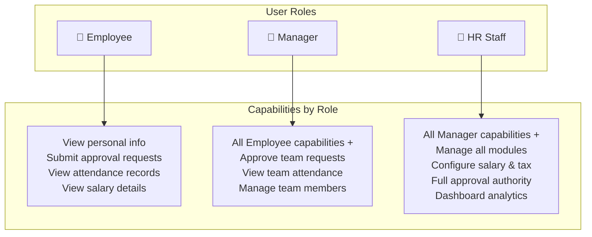
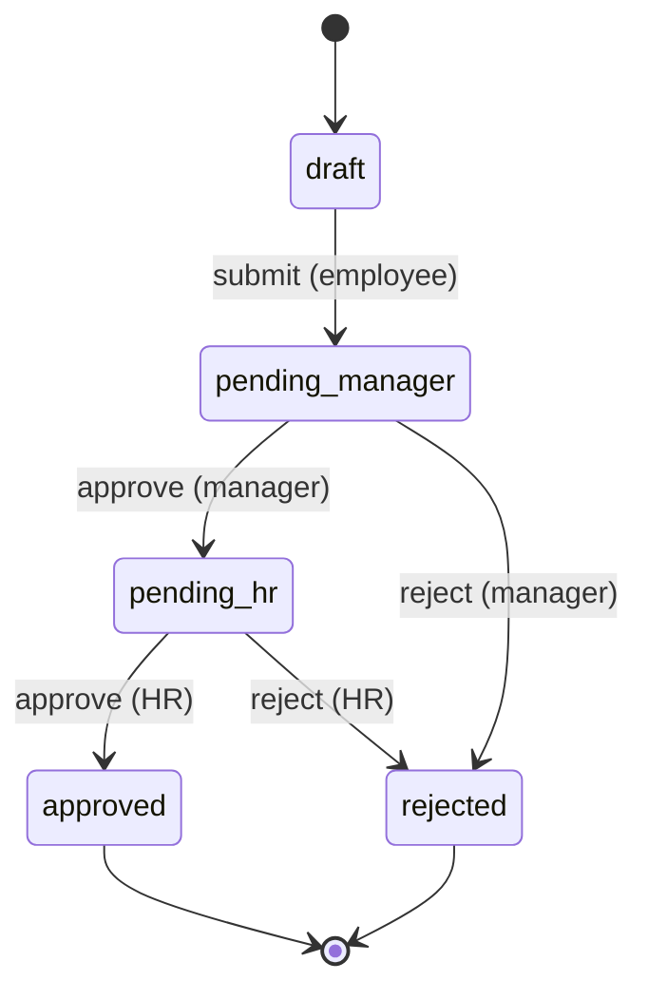
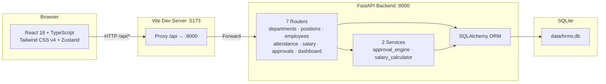
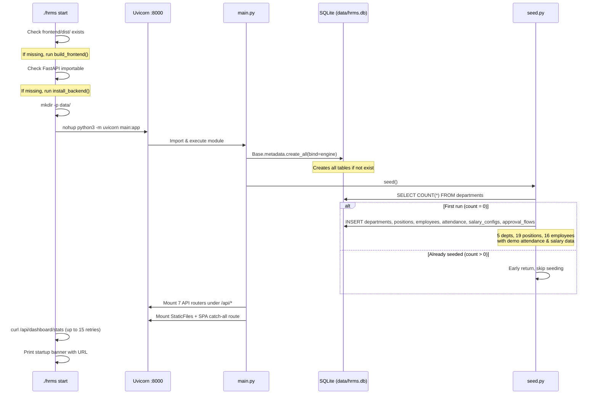
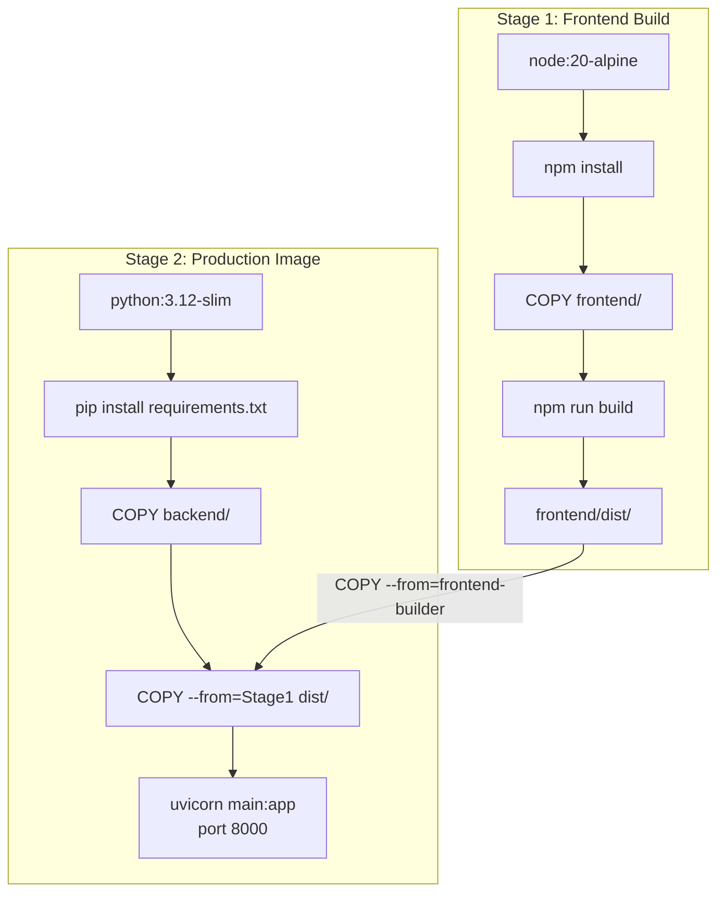

# Project Overview & Quick Start

<details>
<summary>Related Source Files</summary>

backend/main.py
backend/database.py
backend/seed.py
backend/models.py
frontend/src/main.tsx
frontend/src/App.tsx
frontend/vite.config.ts
frontend/src/api/index.ts
frontend/src/stores/appStore.ts
frontend/src/i18n.ts
frontend/src/components/Layout.tsx
hrms
Dockerfile
docker-compose.yml

</details>

## Overview

HRMS (人力资源管理系统) is a full-stack human resource management web application designed as a self-contained, demo-ready system. It provides a complete HR management solution covering departments, positions, employees, attendance tracking, salary calculation with China mainland tax rules, and approval workflows powered by a finite state machine engine. The system is built with a Python FastAPI backend and a React 18 + TypeScript frontend, offering bilingual support (Chinese/English) and role-based access for employees, managers, and HR staff. With auto-seeded demo data and a custom bash management script, new users can get the system running within minutes.

## Project Overview

### Core Value Proposition

HRMS delivers an integrated HR management platform that unifies six core business domains into a single, cohesive web application:

| Domain | Capability | Key Feature |
|--------|-----------|-------------|
| **Department Management** | Organizational structure | CRUD operations with employee/position relationships |
| **Position Management** | Job role administration | Level-based grading (P4–P7) linked to departments |
| **Employee Management** | Workforce records | Full profiles with department/position assignment, avatar support |
| **Attendance Tracking** | Time & attendance | Check-in/out logging, daily status, monthly statistics |
| **Salary Calculation** | Payroll processing | China mainland 7-tier progressive income tax, housing fund & social insurance |
| **Approval Workflow** | Request routing | State machine engine: draft → pending_manager → pending_hr → approved/rejected |

### Technology Stack

The system employs a modern, lightweight technology stack chosen for developer productivity and deployment simplicity:

**Backend Stack:**

| Technology | Version | Purpose |
|-----------|---------|---------|
| FastAPI | 0.115.12 | High-performance async web framework with automatic OpenAPI docs |
| SQLAlchemy | 2.0.40 | ORM with Mapped column types and relationship declarations |
| SQLite | Built-in | Zero-config embedded database, ideal for single-instance deployment |
| Pydantic | 2.11.3 | Data validation and serialization (`*Base`/`*Create`/`*Update`/`*Out` schema pattern) |
| Uvicorn | 0.34.2 | ASGI server with hot-reload support |
| python-multipart | 0.0.20 | Form data parsing for file uploads |

**Frontend Stack:**

| Technology | Version | Purpose |
|-----------|---------|---------|
| React | 18.3.1 | Component-based UI with StrictMode enabled |
| TypeScript | ~5.7.3 | Type safety across the entire frontend codebase |
| Vite | 6.3.3 | Fast dev server with HMR and optimized production builds |
| Tailwind CSS | 4.1.4 | Utility-first CSS with `@tailwindcss/vite` plugin |
| React Router | 7.5.2 | Client-side routing with nested route layout |
| Zustand | 5.0.5 | Lightweight state management with localStorage persistence |
| react-i18next | 15.5.1 | Internationalization with Chinese/English translations |
| Axios | 1.9.0 | HTTP client with `/api` base URL preconfigured |
| Recharts | 2.15.3 | Data visualization for dashboard charts |

**DevOps Stack:**

| Technology | Purpose |
|-----------|---------|
| Docker (multi-stage) | Stage 1: Node 20 Alpine builds frontend; Stage 2: Python 3.12 slim runs backend |
| docker-compose | Single-service orchestration with volume mount for data persistence |
| `./hrms` bash script | CLI management tool: start/stop/restart/status/build/logs/rebuild |

### Target User Groups

The system supports three distinct user roles, each with tailored access levels:



- **Employee** (`employee`): Default role. Can view personal information, submit approval requests, and review own attendance and salary records.
- **Manager** (`manager`): Inherits employee capabilities plus the ability to approve team requests at the `pending_manager` stage of the approval workflow.
- **HR Staff** (`hr`): Full administrative access across all modules, including final approval authority at the `pending_hr` stage, salary configuration, and dashboard analytics.

Role switching is managed client-side via `localStorage.getItem('hrms-role')` in [`appStore.ts`](frontend/src/stores/appStore.ts:11), making the system suitable for demo and development scenarios. The role directly determines which approval stage a user can act on (see [Approval Workflow State Machine](#approval-workflow-state-machine) below).

### Approval Workflow State Machine

The approval system is one of the most technically sophisticated components in HRMS. It implements a finite state machine in [`approval_engine.py`](backend/services/approval_engine.py) that governs how requests flow through organizational hierarchy:



Each transition is recorded as an [`ApprovalRecord`](backend/models.py:99) with the approver ID, action type (`submit`/`approve`/`reject`), and optional comment. The `current_approver_id` field on [`ApprovalFlow`](backend/models.py:81) is updated at each state transition, enabling the UI to show pending actions for the current user. This design ensures that no request can bypass the two-tier review process (manager → HR), enforcing organizational governance through code rather than convention.

### Architecture Overview



The application follows a clean layered architecture: the React SPA communicates with the FastAPI backend exclusively through `/api/*` REST endpoints. In development mode, Vite's proxy forwards API calls to the backend; in production, the backend serves the frontend's static files directly, eliminating the need for a separate web server.

### Data Model Relationships

The 7 ORM models defined in [`models.py`](backend/models.py) form a relational graph centered on the `Employee` entity:

```mermaid
erDiagram
    Department ||--o{ Position : "has many"
    Department ||--o{ Employee : "has many"
    Position ||--o{ Employee : "has many"
    Employee ||--o{ Attendance : "has many"
    Employee ||--o| SalaryConfig : "has one"
    Employee ||--o{ ApprovalFlow : "applicant"
    Employee ||--o{ ApprovalFlow : "current_approver"
    ApprovalFlow ||--o{ ApprovalRecord : "cascade"

    Department {
        int id PK
        string name
        string description
    }
    Position {
        int id PK
        int department_id FK
        string title
        string level
    }
    Employee {
        int id PK
        string name
        string role
        int department_id FK
        int position_id FK
    }
    Attendance {
        int id PK
        int employee_id FK
        date date
        datetime check_in
    }
    SalaryConfig {
        int id PK
        int employee_id FK_UK
        float base_salary
        float housing_fund_rate
    }
    ApprovalFlow {
        int id PK
        int applicant_id FK
        int current_approver_id FK
        string state
    }
```

Key relationship patterns: `Department` ↔ `Position` is one-to-many (a department has many positions); `Employee` ↔ `SalaryConfig` is one-to-one (via `uselist=False` and `unique=True` on `employee_id`); `ApprovalFlow` → `ApprovalRecord` uses cascade delete (`cascade="all, delete-orphan"`), so deleting a flow removes all its records.

### Core Directory Structure

```
hrms/
├── backend/                    # Python FastAPI backend
│   ├── main.py                 # App entry: creates tables, seeds data, mounts routers & static files
│   ├── database.py             # SQLAlchemy engine + session, DB path via HRMS_DATA_DIR env
│   ├── models.py               # 6 ORM models: Department, Position, Employee, Attendance, SalaryConfig, ApprovalFlow/Record
│   ├── schemas.py              # Pydantic schemas: *Base, *Create, *Update, *Out pattern
│   ├── seed.py                 # Demo data: 5 departments, 19 positions, 16 employees, attendance & salary records
│   ├── requirements.txt        # 5 Python dependencies
│   ├── routers/                # API route handlers (7 modules)
│   │   ├── departments.py      # /api/departments CRUD
│   │   ├── positions.py        # /api/positions CRUD with department_id filter
│   │   ├── employees.py        # /api/employees CRUD with pagination & search
│   │   ├── attendance.py       # /api/attendance + /api/attendance/stats
│   │   ├── salary.py           # /api/salary/config/*, /api/salary/calculate
│   │   ├── approvals.py        # /api/approvals CRUD + approve/reject actions
│   │   └── dashboard.py        # /api/dashboard/stats aggregation
│   └── services/               # Business logic layer (2 services)
│       ├── approval_engine.py  # State machine: draft→pending_manager→pending_hr→approved/rejected
│       └── salary_calculator.py # China mainland 7-tier progressive tax calculation
├── frontend/                   # React 18 + TypeScript frontend
│   ├── src/
│   │   ├── main.tsx            # ReactDOM entry with BrowserRouter + StrictMode
│   │   ├── App.tsx             # Route definitions: /, /employees, /departments, /attendance, /salary, /approvals
│   │   ├── i18n.ts             # i18next init with localStorage 'hrms-lang' persistence
│   │   ├── index.css           # Tailwind v4 + custom CSS classes (surface-panel, metric-card, page-enter)
│   │   ├── api/index.ts        # Axios client with baseURL '/api', all endpoints return .then(r => r.data)
│   │   ├── components/
│   │   │   ├── Layout.tsx      # Sidebar navigation + top bar with role switcher & language toggle
│   │   │   └── ui.tsx          # Reusable UI components
│   │   ├── pages/              # Route pages (6 modules)
│   │   ├── stores/
│   │   │   └── appStore.ts     # Zustand store: currentRole + sidebarCollapsed with localStorage sync
│   │   └── locales/            # i18n translation files
│   │       ├── zh.json         # Chinese translations (default)
│   │       └── en.json         # English translations
│   ├── vite.config.ts          # Vite config: React + Tailwind plugins, @/ alias, /api proxy
│   ├── package.json            # 8 runtime deps, 7 dev deps
│   └── dist/                   # Build output (served by backend in production)
├── data/                       # SQLite database storage
│   └── hrms.db                 # Auto-created on first run
├── hrms                        # Bash management CLI script
├── Dockerfile                  # Multi-stage: node:20-alpine → python:3.12-slim
└── docker-compose.yml          # Single service, port 8000, volume ./data:/app/data
```

## Environment Setup & Development Workflow

### Prerequisites

Before setting up the development environment, ensure the following tools are installed:

| Requirement | Minimum Version | Verification Command |
|------------|----------------|---------------------|
| Python | 3.12+ | `python3 --version` |
| Node.js | 20+ | `node --version` |
| npm | Included with Node.js | `npm --version` |
| curl | Any | `curl --version` |

### Management Script Commands

The [`hrms`](hrms) bash script is the primary CLI tool for managing the development lifecycle. It handles dependency installation, frontend builds, server lifecycle, and health checks:

| Command | Description | What It Does |
|---------|-------------|-------------|
| `./hrms start` | Start the server | Auto-builds frontend if `dist/` missing, installs backend deps if needed, launches Uvicorn on port 8000, waits up to 15s for health check |
| `./hrms stop` | Stop the server | Graceful shutdown via PID file, falls back to port-based process kill with SIGKILL if needed |
| `./hrms restart` | Restart the server | Executes `stop` then `start` with 1-second delay |
| `./hrms rebuild` | Full rebuild & restart | Stops server, removes `frontend/dist/`, runs `build`, then starts fresh — use after code changes |
| `./hrms build` | Build without starting | Installs backend deps (`pip3 install -q -r requirements.txt`) and frontend (`npm install --silent && npm run build`) |
| `./hrms status` | Show server status | Displays running state, PID, URL, and performs API health check to show employee count from DB |
| `./hrms logs` | Tail server logs | Streams `tail -f .hrms.log` in real time |

The script maintains state via two files at the project root:
- **`.hrms.pid`**: Stores the Uvicorn process PID for lifecycle management
- **`.hrms.log`**: Captures all Uvicorn stdout/stderr output

### Startup Flow

The application follows a deterministic initialization sequence when the server starts:



Key implementation details from [`main.py`](backend/main.py:13-36):

1. **Table creation** (line 14): `Base.metadata.create_all(bind=engine)` is idempotent — it creates tables only if they don't exist, making it safe for repeated restarts.
2. **Data seeding** (line 15): [`seed()`](backend/seed.py:31) checks `db.query(Department).count() > 0` before inserting, preventing duplicate data on subsequent starts.
3. **Static file serving** (lines 27-36): The backend conditionally mounts `frontend/dist/` only if the directory exists, allowing the backend to run independently during development.

### Development Proxy Configuration

During development, the frontend and backend run as separate processes:

- **Vite dev server** runs on port **5173** and serves the React SPA with Hot Module Replacement (HMR)
- **FastAPI backend** runs on port **8000** and handles API requests

The Vite proxy configuration in [`vite.config.ts`](frontend/vite.config.ts:13-16) forwards all `/api` requests:

```typescript
server: {
  proxy: {
    '/api': 'http://localhost:8000',
  },
},
```

This means when the browser at `http://localhost:5173` makes a request to `/api/employees`, Vite transparently proxies it to `http://localhost:8000/api/employees`. The developer workflow is:

1. Run `./hrms start` to launch the backend
2. In a separate terminal, run `cd frontend && npm run dev` for the Vite dev server
3. Open `http://localhost:5173` in the browser

### Production Mode

In production, the backend serves both the API and the frontend static files from a single port:

The SPA routing logic in [`main.py`](backend/main.py:31-36) handles client-side routing:

1. `/assets/*` requests are served via `StaticFiles` mount for Vite-built JS/CSS bundles
2. For any other path, if a matching file exists in `frontend/dist/`, it's served directly
3. If no file matches, `index.html` is returned — enabling React Router's client-side routing to take over

The Dockerfile implements a multi-stage build optimized for production:



The `docker-compose.yml` mounts `./data:/app/data` as a volume, ensuring database persistence across container restarts while the `HRMS_DATA_DIR` environment variable in [`database.py`](backend/database.py:6) defaults to `../data` relative to the backend directory.

## Quick Reference

### Port Configuration

| Mode | Frontend | Backend API | Access URL |
|------|----------|-------------|------------|
| Development | 5173 (Vite HMR) | 8000 | `http://localhost:5173` (proxies `/api` to `:8000`) |
| Production | — | 8000 (serves static files) | `http://localhost:8000` |
| Docker | — | 8000 (exposed) | `http://localhost:8000` |

### CLI Commands

```bash
./hrms start      # Start server (auto-build if needed, waits for health check)
./hrms stop       # Stop server (graceful → forced shutdown)
./hrms restart    # Stop + Start with 1s delay
./hrms rebuild    # Full rebuild: stop → clean dist → build → start
./hrms build      # Build frontend & install deps without starting
./hrms status     # Show PID, URL, health check result, build status
./hrms logs       # Tail -f the server log file
```

### API Endpoint Reference

All endpoints use the `/api/*` prefix. The Axios client in [`api/index.ts`](frontend/src/api/index.ts:3) is preconfigured with `baseURL: '/api'`.

| Module | Endpoints | Key Operations |
|--------|-----------|---------------|
| Departments | `/api/departments` | GET (list), POST (create), PUT `/:id`, DELETE `/:id` |
| Positions | `/api/positions` | GET (list, filter by `department_id`), POST, PUT `/:id`, DELETE `/:id` |
| Employees | `/api/employees` | GET (list with pagination/search), GET `/:id`, POST, PUT `/:id`, DELETE `/:id` |
| Attendance | `/api/attendance` | GET (list), `/api/attendance/stats` (monthly aggregation) |
| Salary | `/api/salary/config/:employeeId` | GET/PUT salary config; `/api/salary/calculate` POST calculation |
| Approvals | `/api/approvals` | GET (list), GET `/:id`, POST (create), `/:id/approve`, `/:id/reject` |
| Dashboard | `/api/dashboard/stats` | GET aggregated metrics |

**List endpoint response format** (consistent across all modules):

```json
{
  "total": 42,
  "items": [...]
}
```

### Database Location

| Property | Value |
|----------|-------|
| Default path | `data/hrms.db` (relative to project root) |
| Configurable via | `HRMS_DATA_DIR` environment variable |
| Engine | SQLite with `check_same_thread=False` for async compatibility |
| Auto-creation | Directory created via `os.makedirs(DATA_DIR, exist_ok=True)` in [`database.py`](backend/database.py:7) |

### Frontend Conventions

| Convention | Value | Source |
|-----------|-------|--------|
| Path alias | `@/` → `src/` | [`vite.config.ts`](frontend/vite.config.ts:10) + `tsconfig.json` |
| API client | `axios.create({ baseURL: '/api' })` | [`api/index.ts`](frontend/src/api/index.ts:3) |
| State management | Zustand with `create<AppState>()` | [`appStore.ts`](frontend/src/stores/appStore.ts:10) |
| CSS framework | Tailwind CSS v4 via `@tailwindcss/vite` plugin | [`vite.config.ts`](frontend/vite.config.ts:7) |
| Custom CSS classes | `surface-panel`, `metric-card`, `page-enter` | [`index.css`](frontend/src/index.css) |

### i18n Configuration

| Property | Value |
|----------|-------|
| Storage key | `localStorage.getItem('hrms-lang')` |
| Default language | `zh` (Chinese) |
| Supported languages | `zh` (Chinese), `en` (English) |
| Fallback | `zh` |
| Implementation | `react-i18next` with `initReactI18next` |
| Translation files | [`locales/zh.json`](frontend/src/locales/zh.json), [`locales/en.json`](frontend/src/locales/en.json) |

The language preference is read on app initialization in [`i18n.ts`](frontend/src/i18n.ts:6): `const savedLang = localStorage.getItem('hrms-lang') || 'zh'`

### Role Configuration

| Property | Value |
|----------|-------|
| Storage key | `localStorage.getItem('hrms-role')` |
| Default role | `employee` |
| Valid values | `employee` · `manager` · `hr` |
| Persisted on change | Yes — `localStorage.setItem('hrms-role', role)` in [`appStore.ts`](frontend/src/stores/appStore.ts:13) |

The role controls which UI elements are visible (navigation items, action buttons) and determines the approval workflow behavior — managers approve at the `pending_manager` stage, HR staff approve at the `pending_hr` stage (see [Approval Workflow State Machine](#approval-workflow-state-machine) for the full state diagram).

**Quick navigation**: For setup instructions, see [Environment Setup & Development Workflow](#environment-setup--development-workflow). For a compact command/API reference, see [Quick Reference](#quick-reference).
