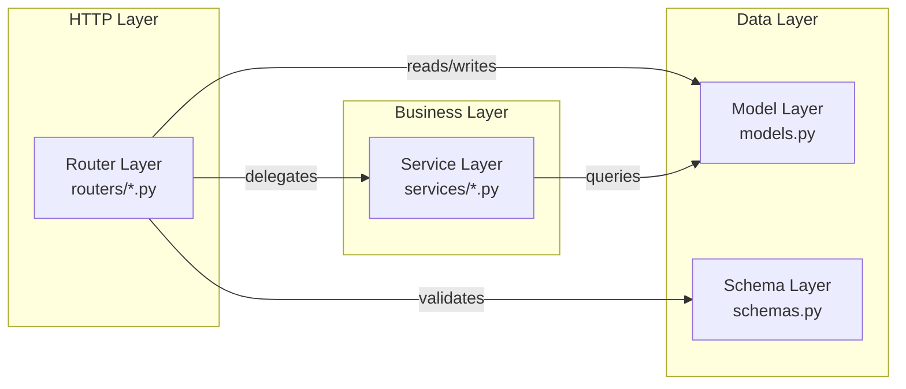
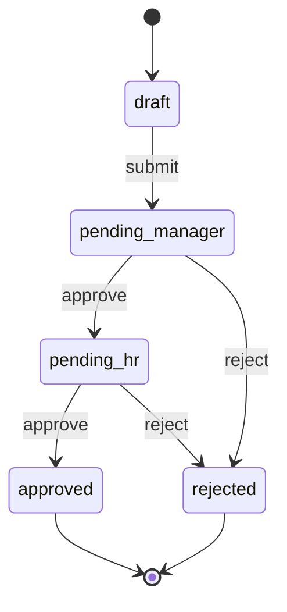
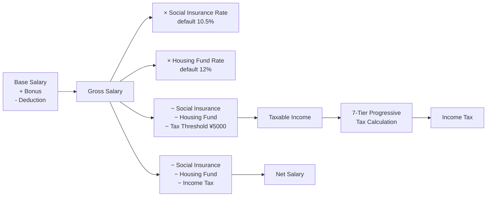
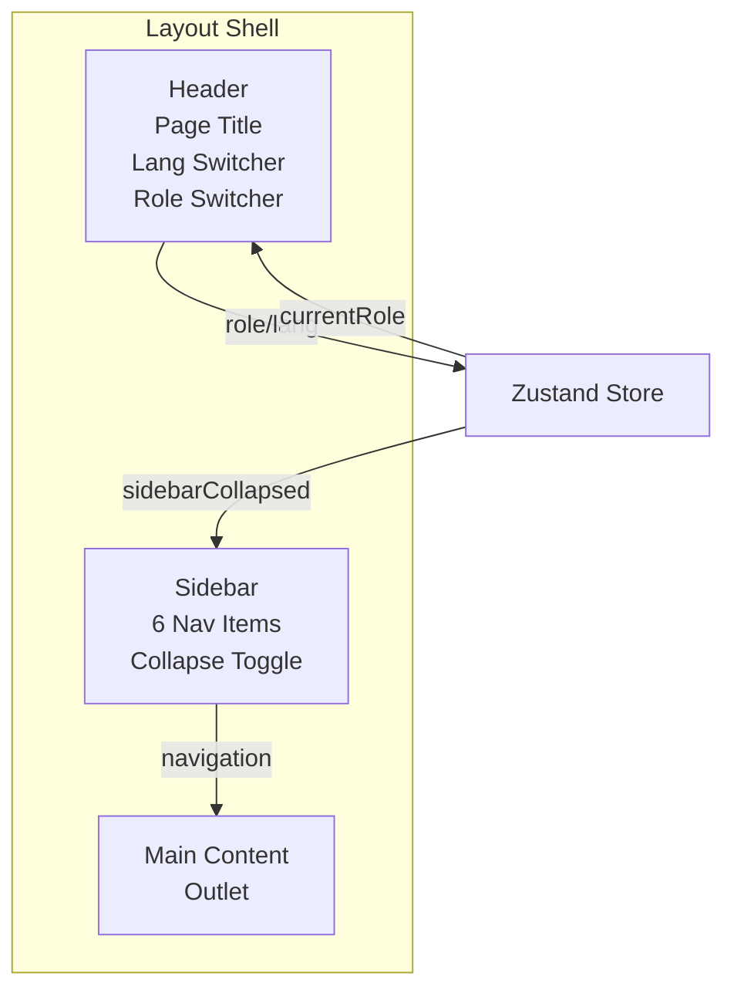
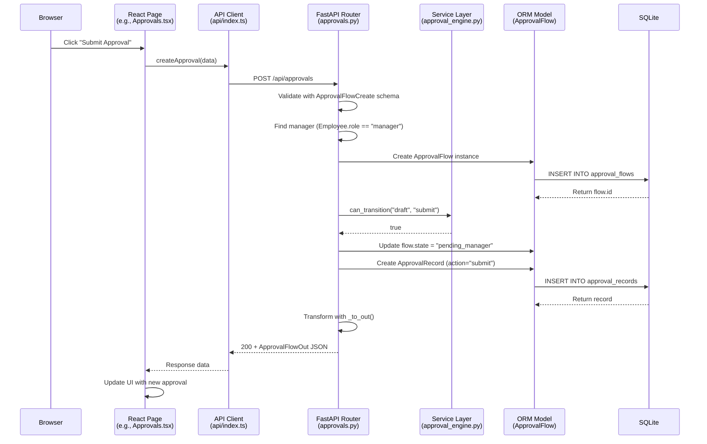

# System Architecture & Technical Design

<details>
<summary>Related Source Files</summary>

backend/main.py
backend/database.py
backend/models.py
backend/schemas.py
backend/seed.py
backend/routers/departments.py
backend/routers/positions.py
backend/routers/employees.py
backend/routers/attendance.py
backend/routers/salary.py
backend/routers/approvals.py
backend/routers/dashboard.py
backend/services/approval_engine.py
backend/services/salary_calculator.py
frontend/src/main.tsx
frontend/src/App.tsx
frontend/src/components/Layout.tsx
frontend/src/components/ui.tsx
frontend/src/stores/appStore.ts
frontend/src/api/index.ts
frontend/src/i18n.ts
frontend/src/index.css
frontend/vite.config.ts

</details>

## Overview

HRMS is a full-stack human resource management system built with a clean **layered architecture** that separates concerns across backend and frontend. The backend follows a **Router → Service → Model → Schema** four-layer pattern, where FastAPI routers handle HTTP endpoints, service modules encapsulate business logic (approval state machine, salary tax computation), SQLAlchemy models define the ORM layer, and Pydantic schemas enforce request/response validation. The frontend adopts a **Page → Store → API** pattern with React 18, where Zustand manages client-side state, Axios provides a typed API client, and React Router v7 handles navigation within a Layout shell. SQLite serves as the self-contained persistence layer, auto-seeded with demo data on first startup. This architecture prioritizes simplicity and rapid iteration — the entire system runs from a single command, with zero external infrastructure dependencies.

## System Architecture Overview

> **Cross-reference**: The backend layering described here is detailed in [Backend Architecture](#backend-architecture). The frontend routing and state management are expanded in [Frontend Architecture](#frontend-architecture). The data entities shown flowing through the system are analyzed in [Data Model & Relationships](#data-model--relationships).

```mermaid
graph TB
    subgraph "Frontend (React 18 + TypeScript)"
        Browser[Browser Client]
        Main[main.tsx<br/>Bootstrap]
        App[App.tsx<br/>Router Config]
        Layout[Layout.tsx<br/>Shell + Sidebar]
        Pages[Page Components<br/>Dashboard | Employees<br/>Departments | Attendance<br/>Salary | Approvals]
        Store[Zustand Store<br/>appStore.ts]
        APIClient[API Client<br/>api/index.ts]
        I18n[i18n<br/>zh / en]
        UI[UI Components<br/>ui.tsx]
    end

    subgraph "Backend (FastAPI + SQLAlchemy)"
        FastAPI[FastAPI App<br/>main.py]
        Routers[Router Layer<br/>7 Routers]
        Services[Service Layer<br/>approval_engine<br/>salary_calculator]
        Models[ORM Models<br/>models.py<br/>7 Models]
        Schemas[Pydantic Schemas<br/>schemas.py]
        DB[SQLite<br/>database.py]
    end

    Browser --> Main --> App --> Layout --> Pages
    Pages --> Store
    Pages --> APIClient --> FastAPI
    Pages --> I18n
    Pages --> UI
    Layout --> Store
    FastAPI --> Routers --> Services
    Routers --> Models --> DB
    Routers --> Schemas
```

The diagram above illustrates the complete request flow: a browser request enters through [`main.tsx`](frontend/src/main.tsx:1), routes through [`App.tsx`](frontend/src/App.tsx:1) into the [`Layout`](frontend/src/components/Layout.tsx:1) shell, and renders the appropriate page component. Pages communicate with the backend through the centralized [`api/index.ts`](frontend/src/api/index.ts:1) Axios client, which sends requests to FastAPI routers. Routers delegate to services for business logic and interact with SQLAlchemy models for data persistence.

## Backend Architecture

### Entry Point and Application Bootstrap

The backend entry point [`backend/main.py`](backend/main.py:1) performs four critical initialization steps at startup:

1. **Database Schema Creation** — `Base.metadata.create_all(bind=engine)` at [line 14](backend/main.py:14) creates all tables defined in [`models.py`](backend/models.py:1) if they do not already exist.
2. **Demo Data Seeding** — `seed()` at [line 15](backend/main.py:15) populates the database with sample departments, employees, attendance records, salary configurations, and approval flows (idempotent — skips if data exists).
3. **Router Registration** — Seven routers are registered at [lines 18–24](backend/main.py:18), each with its own `/api/*` prefix and Swagger tag.
4. **SPA Static File Serving** — [Lines 27–36](backend/main.py:27) mount the built frontend assets and implement a catch-all route that serves `index.html` for client-side routing.

```python
# backend/main.py — Router registration
app.include_router(departments.router)   # /api/departments
app.include_router(positions.router)     # /api/positions
app.include_router(employees.router)     # /api/employees
app.include_router(attendance.router)    # /api/attendance
app.include_router(salary.router)        # /api/salary
app.include_router(approvals.router)     # /api/approvals
app.include_router(dashboard.router)     # /api/dashboard
```

### Layered Architecture

The backend follows a strict four-layer separation of concerns:



**Router Layer** (`backend/routers/`) — Each router file defines HTTP endpoints using FastAPI's `APIRouter`. Routers are responsible for request validation (via Pydantic schema injection), database session acquisition (via `Depends(get_db)`), and response serialization. They delegate complex business logic to the service layer.

**Service Layer** (`backend/services/`) — Contains two standalone business logic modules:
- [`approval_engine.py`](backend/services/approval_engine.py:1) — Implements a finite state machine governing the approval workflow. Defines `VALID_TRANSITIONS` as a dictionary mapping each state to its permitted actions and resulting states. Exposes `can_transition()` and `next_state()` pure functions.
- [`salary_calculator.py`](backend/services/salary_calculator.py:1) — Implements China mainland individual income tax calculation with 7 progressive brackets. The `calculate_salary()` function computes gross salary, social insurance, housing fund, taxable income, income tax, and net salary.

**Model Layer** (`backend/models.py`) — Defines 7 SQLAlchemy ORM models using the `Mapped` type annotation pattern with `mapped_column`. All models inherit from `Base` (the `DeclarativeBase` subclass from [`database.py`](backend/database.py:14)).

**Schema Layer** (`backend/schemas.py`) — Defines Pydantic schemas following the `*Base` / `*Create` / `*Update` / `*Out` pattern. `*Base` contains shared fields, `*Create` and `*Update` inherit from `*Base` for input validation, and `*Out` adds computed fields (like `employee_name`, `department_name`) and enables `from_attributes = True` for ORM-to-PyDantic conversion.

### Database Configuration

[`backend/database.py`](backend/database.py:1) configures SQLAlchemy with SQLite:

```python
# backend/database.py — Key configuration
DATA_DIR = os.environ.get("HRMS_DATA_DIR", os.path.join(os.path.dirname(os.path.abspath(__file__)), "..", "data"))
DATABASE_URL = f"sqlite:///{os.path.join(DATA_DIR, 'hrms.db')}"
engine = create_engine(DATABASE_URL, connect_args={"check_same_thread": False})
SessionLocal = sessionmaker(autocommit=False, autoflush=False, bind=engine)
```

Key design decisions:
- **Configurable data directory** — The `HRMS_DATA_DIR` environment variable overrides the default `data/` path ([line 6](backend/database.py:6)), enabling flexible deployment.
- **Thread safety** — `check_same_thread: False` ([line 10](backend/database.py:10)) allows SQLite to be used with FastAPI's threaded request handling (SQLite's default restricts connections to the creating thread).
- **Dependency injection** — `get_db()` ([line 18](backend/database.py:18)) is a generator function that yields a database session and ensures cleanup via `try/finally`. It is injected into routers via `Depends(get_db)`.

### API Design Patterns

All routers follow a consistent design pattern:

**Prefix Convention** — Every router uses `prefix="/api/{entity}"` and `tags=["{entity}"]`:
```python
router = APIRouter(prefix="/api/departments", tags=["departments"])  # departments.py line 7
router = APIRouter(prefix="/api/employees", tags=["employees"])       # employees.py line 7
```

**Pagination** — List endpoints that may return large datasets support `page` and `page_size` query parameters:
```python
@router.get("", response_model=dict)
def list_employees(
    search: str | None = None,
    department_id: int | None = None,
    status: str | None = None,
    page: int = Query(1, ge=1),
    page_size: int = Query(20, ge=1, le=100),
    db: Session = Depends(get_db),
):
```
Response format: `{"total": <count>, "items": [...]}`

**Data Transformation Helpers** — Routers define `_to_out()` helper functions that transform ORM model instances into Pydantic `*Out` schemas, enriching them with cross-referenced data:

```python
# backend/routers/employees.py line 10
def _to_out(emp: Employee, db: Session) -> EmployeeOut:
    dept_name = ""
    pos_title = ""
    if emp.department_id:
        dept = db.query(Department).filter(Department.id == emp.department_id).first()
        dept_name = dept.name if dept else ""
    if emp.position_id:
        pos = db.query(Position).filter(Position.id == emp.position_id).first()
        pos_title = pos.title if pos else ""
    return EmployeeOut(...)
```

This pattern is used in [`employees.py`](backend/routers/employees.py:10), [`approvals.py`](backend/routers/approvals.py:12), and inline in [`departments.py`](backend/routers/departments.py:14), [`positions.py`](backend/routers/positions.py:17), and [`attendance.py`](backend/routers/attendance.py:27).

### Approval State Machine

The approval workflow is governed by a finite state machine defined in [`approval_engine.py`](backend/services/approval_engine.py:1):



The `VALID_TRANSITIONS` dictionary at [line 11](backend/services/approval_engine.py:11) maps each state to its permitted action→next-state pairs. Terminal states (`approved`, `rejected`) map to empty dictionaries, preventing any further transitions. The router layer enforces this machine — [`approvals.py` line 94](backend/routers/approvals.py:94) calls `can_transition()` before processing approve/reject actions, returning HTTP 400 for invalid transitions.

### Salary Calculation Pipeline

The salary calculator in [`salary_calculator.py`](backend/services/salary_calculator.py:1) implements China mainland individual income tax rules:



The 7-tier progressive tax bracket table ([line 4](backend/services/salary_calculator.py:4)) ranges from 3% (≤¥3,000) to 45% (>¥80,000), with quick deductions at each tier:

| Monthly Taxable Income (¥) | Rate | Quick Deduction (¥) |
|---------------------------|------|---------------------|
| ≤ 3,000 | 3% | 0 |
| 3,001 – 12,000 | 10% | 210 |
| 12,001 – 25,000 | 20% | 1,410 |
| 25,001 – 35,000 | 25% | 2,660 |
| 35,001 – 55,000 | 30% | 4,410 |
| 55,001 – 80,000 | 35% | 7,160 |
| > 80,000 | 45% | 15,160 |

The `calculate_tax()` function ([line 17](backend/services/salary_calculator.py:17)) iterates brackets in ascending order, selecting the first bracket where `taxable_income <= upper`. This is O(k) where k=7 (constant), making it effectively O(1). The tax threshold of ¥5,000 ([line 14](backend/services/salary_calculator.py:14)) is subtracted from pre-tax income before bracket lookup, matching the China mainland individual income tax policy.

## Frontend Architecture

### Bootstrap and Entry Point

[`frontend/src/main.tsx`](frontend/src/main.tsx:1) is the application entry point that renders the React root:

```tsx
ReactDOM.createRoot(document.getElementById('root')!).render(
  <React.StrictMode>
    <BrowserRouter>
      <App />
    </BrowserRouter>
  </React.StrictMode>,
)
```

It wraps the entire application in `React.StrictMode` for development checks and `BrowserRouter` for client-side routing. The global stylesheet [`index.css`](frontend/src/index.css:1) is imported at [line 5](frontend/src/main.tsx:5).

### Routing Configuration

[`frontend/src/App.tsx`](frontend/src/App.tsx:1) defines 6 child routes nested under a `Layout` wrapper:

```tsx
<Routes>
  <Route path="/" element={<Layout />}>
    <Route index element={<Dashboard />} />
    <Route path="employees" element={<Employees />} />
    <Route path="departments" element={<Departments />} />
    <Route path="attendance" element={<Attendance />} />
    <Route path="salary" element={<Salary />} />
    <Route path="approvals" element={<Approvals />} />
  </Route>
</Routes>
```

The `Layout` component renders an `<Outlet />` for nested route content, providing a persistent sidebar and header shell across all pages.

### Layout Shell

[`frontend/src/components/Layout.tsx`](frontend/src/components/Layout.tsx:1) implements the application shell with:

- **Sidebar Navigation** — 6 navigation items ([lines 13–85](frontend/src/components/Layout.tsx:13)) with SVG icons, active state highlighting via gradient background, and a collapsible toggle button.
- **Role Switcher** — A `<select>` element ([line 276](frontend/src/components/Layout.tsx:276)) bound to `currentRole` from Zustand store, allowing switching between `employee`, `manager`, and `hr` views.
- **Language Switcher** — A dropdown with globe icon ([line 246](frontend/src/components/Layout.tsx:246)) that calls `i18n.changeLanguage()` and persists the selection to `localStorage` key `hrms-lang`.
- **Header** — Sticky header with page title/subtitle derived from current route path, using i18n translation keys mapped in `pageTitleKeys` and `pageSubtitleKeys`.



### State Management

[`frontend/src/stores/appStore.ts`](frontend/src/stores/appStore.ts:1) uses Zustand with a minimal but effective state shape:

```typescript
interface AppState {
  currentRole: string        // 'employee' | 'manager' | 'hr'
  setCurrentRole: (role: string) => void
  sidebarCollapsed: boolean   // sidebar toggle state
  toggleSidebar: () => void
}
```

**Persistence strategy** — `currentRole` is persisted to `localStorage` under key `hrms-role` ([line 13](frontend/src/stores/appStore.ts:13)). On store creation ([line 11](frontend/src/stores/appStore.ts:11)), it reads `localStorage.getItem('hrms-role')` with `'employee'` as fallback. `sidebarCollapsed` is session-only (no persistence).

### API Client

[`frontend/src/api/index.ts`](frontend/src/api/index.ts:1) creates a centralized Axios instance with `baseURL: '/api'` and exports 22 typed functions covering all backend endpoints:

| Domain | Functions | HTTP Methods |
|--------|-----------|-------------|
| Departments | `getDepartments`, `createDepartment`, `updateDepartment`, `deleteDepartment` | GET, POST, PUT, DELETE |
| Positions | `getPositions`, `createPosition`, `updatePosition`, `deletePosition` | GET, POST, PUT, DELETE |
| Employees | `getEmployees`, `getEmployee`, `createEmployee`, `updateEmployee`, `deleteEmployee` | GET, POST, PUT, DELETE |
| Attendance | `getAttendance`, `getAttendanceStats` | GET, GET |
| Salary | `getSalaryConfig`, `updateSalaryConfig`, `calculateSalary` | GET, PUT, POST |
| Approvals | `getApprovals`, `getApproval`, `createApproval`, `approveFlow`, `rejectFlow` | GET, GET, POST, POST, POST |
| Dashboard | `getDashboardStats` | GET |

All functions use the pattern `api.<method>(...).then(r => r.data)` to unwrap the Axios response, returning only the data payload.

### Styling System

The frontend uses **Tailwind CSS v4** integrated via the `@tailwindcss/vite` plugin ([`vite.config.ts` line 7](frontend/vite.config.ts:7)), with a CSS custom properties design token system defined in [`index.css`](frontend/src/index.css:3):

**Design Tokens** (23 CSS variables in `:root`):

| Category | Variables | Example |
|----------|-----------|---------|
| Layout | `--sidebar-width`, `--sidebar-collapsed`, `--header-height` | `296px`, `92px`, `78px` |
| Color | `--accent`, `--accent-strong`, `--accent-soft` | `#577bff`, `#3558df` |
| Surface | `--surface`, `--surface-strong`, `--surface-muted`, `--bg` | Various rgba values |
| Text | `--text-primary`, `--text-secondary`, `--text-muted` | `#152033`, `#52607a`, `#8b97ad` |
| Semantic | `--success`, `--warning`, `--danger` | `#14946a`, `#d99012`, `#d74c60` |
| Shadow | `--shadow-soft`, `--shadow-card` | Various box-shadows |
| Border | `--border`, `--border-strong` | Various rgba values |

**Custom CSS Classes** — The stylesheet defines reusable classes for the design system:
- `.surface-panel` — Frosted glass card with gradient, 28px border-radius, backdrop-filter blur
- `.metric-card` — Statistical display card with icon slot and gradient background
- `.page-enter` — Fade-and-slide-up entrance animation (0.3s ease-out)
- `.btn-primary` / `.btn-secondary` / `.btn-danger` — Pill-shaped action buttons with gradient fills
- `.data-table` — Styled table with uppercase micro-headers and hover highlights
- `.modal-overlay` / `.modal-card` — Centered modal with blurred backdrop
- `.field` / `.field-area` / `.field-select` — Form inputs with focus ring animation

**Responsive Breakpoint** — At `max-width: 900px` ([line 368](frontend/src/index.css:368)), sidebar collapses to 84px and header height reduces to 72px.

### Internationalization

[`frontend/src/i18n.ts`](frontend/src/i18n.ts:1) configures react-i18next with Chinese and English locales:

```typescript
const savedLang = localStorage.getItem('hrms-lang') || 'zh'
i18n.use(initReactI18next).init({
  resources: { zh: { translation: zh }, en: { translation: en } },
  lng: savedLang,
  fallbackLng: 'zh',
  interpolation: { escapeValue: false },
})
```

Key design decisions:
- **Synchronous initialization** — Locale resources are bundled at build time (imported from `./locales/zh.json` and `./locales/en.json`), avoiding async loading complexity.
- **localStorage persistence** — Language preference stored under key `hrms-lang`, read at init and written on change.
- **Chinese as default** — `fallbackLng: 'zh'` ensures Chinese is the fallback when a translation key is missing.

### UI Component Library

[`frontend/src/components/ui.tsx`](frontend/src/components/ui.tsx:1) provides 5 reusable components:

| Component | Purpose | Key Features |
|-----------|---------|-------------|
| `PageHeader` | Page-level header section | Eyebrow label, title, description, action buttons, radial gradient decoration |
| `Panel` | Content card container | Title, description, action slot, border-bottom header separator |
| `StatCard` | Metric display card | Label, value, hint, icon slot, 5 color tones (blue/green/amber/rose/slate) |
| `EmptyState` | Empty data placeholder | Icon, title, description, centered layout |
| `ModalShell` | Modal dialog container | Title, subtitle, close button, footer, backdrop-click-to-close, max-width configurable |

The `cx()` utility function ([line 3](frontend/src/components/ui.tsx:3)) provides conditional class name joining, similar to a lightweight `clsx`.

### Build and Dev Proxy

[`frontend/vite.config.ts`](frontend/vite.config.ts:1) configures:
- **Path alias** — `@` maps to `./src` ([line 10](frontend/vite.config.ts:10)), enabling clean imports like `@/stores/appStore`.
- **Dev proxy** — `/api` requests are proxied to `http://localhost:8000` ([line 15](frontend/vite.config.ts:15)), enabling seamless full-stack development without CORS issues.

### Full-Stack Request Flow

The following sequence diagram illustrates the end-to-end flow of a typical data operation — creating an approval request — from the user interacting with the frontend through to database persistence and back:



This flow demonstrates the layered architecture in action: the frontend delegates to the API client which sends a validated HTTP request; the router validates input with Pydantic schemas, delegates business logic (state machine validation) to the service layer, and persists data through the ORM model layer.

## Data Model & Relationships

### Entity Relationship Diagram

```mermaid
erDiagram
    Department ||--o{ Employee : "has many"
    Department ||--o{ Position : "has many"
    Position ||--o{ Employee : "has many"
    Employee ||--o{ Attendance : "has many"
    Employee ||--|| SalaryConfig : "has one"
    Employee ||--o{ ApprovalFlow : "applies (applicant)"
    Employee ||--o{ ApprovalFlow : "approves (current_approver)"
    ApprovalFlow ||--o{ ApprovalRecord : "has many (cascade)"
    Employee ||--o{ ApprovalRecord : "approves"

    Department {
        int id PK
        string name
        string description
        datetime created_at
    }
    Position {
        int id PK
        int department_id FK
        string title
        string level
        datetime created_at
    }
    Employee {
        int id PK
        string name
        string email
        string phone
        string gender
        string avatar
        int department_id FK
        int position_id FK
        date hire_date
        string status
        string role
        datetime created_at
    }
    Attendance {
        int id PK
        int employee_id FK
        date date
        datetime check_in
        datetime check_out
        string status
    }
    SalaryConfig {
        int id PK
        int employee_id FK_UK
        float base_salary
        float housing_fund_rate
        float social_insurance_rate
        float bonus
        float deduction
    }
    ApprovalFlow {
        int id PK
        string title
        string type
        int applicant_id FK
        dict content
        string state
        int current_approver_id FK
        datetime created_at
        datetime updated_at
    }
    ApprovalRecord {
        int id PK
        int flow_id FK
        int approver_id FK
        string action
        string comment
        datetime created_at
    }
```

### Model Details and Relationship Patterns

The data model in [`backend/models.py`](backend/models.py:1) uses SQLAlchemy 2.0's `Mapped` type annotation pattern with `mapped_column` for type-safe column definitions. All models inherit from `Base` (the `DeclarativeBase` from [`database.py`](backend/database.py:14)). The corresponding Pydantic schemas that validate API input/output for each model are defined in [`backend/schemas.py`](backend/schemas.py:1) — see the [Backend Architecture → Schema Layer](#layered-architecture) section for details on the `*Base`/`*Create`/`*Update`/`*Out` pattern.

#### Department

```python
class Department(Base):
    __tablename__ = "departments"
    id: Mapped[int] = mapped_column(Integer, primary_key=True, index=True)
    name: Mapped[str] = mapped_column(String(100), nullable=False)
    description: Mapped[str | None] = mapped_column(Text, nullable=True)
    created_at: Mapped[datetime] = mapped_column(DateTime, default=datetime.utcnow)
    employees: Mapped[list["Employee"]] = relationship(back_populates="department")
    positions: Mapped[list["Position"]] = relationship(back_populates="department")
```

Department is the top-level organizational entity. It has **one-to-many** relationships with both `Employee` and `Position` via `back_populates`, creating bidirectional navigation. The `employees` relationship uses `list["Employee"]` type annotation, indicating multiple related objects.

#### Position

```python
class Position(Base):
    __tablename__ = "positions"
    department_id: Mapped[int] = mapped_column(Integer, ForeignKey("departments.id"))
    level: Mapped[str | None] = mapped_column(String(50), nullable=True)
    department: Mapped["Department"] = relationship(back_populates="positions")
    employees: Mapped[list["Employee"]] = relationship(back_populates="position")
```

Position belongs to a `Department` via `ForeignKey("departments.id")` and has its own one-to-many relationship with `Employee`. The `level` field (e.g., "P5", "P6", "P7") represents the job grade within the career ladder.

#### Employee

```python
class Employee(Base):
    __tablename__ = "employees"
    department_id: Mapped[int | None] = mapped_column(Integer, ForeignKey("departments.id"), nullable=True)
    position_id: Mapped[int | None] = mapped_column(Integer, ForeignKey("positions.id"), nullable=True)
    role: Mapped[str] = mapped_column(String(20), default="employee")  # employee/manager/hr
    status: Mapped[str] = mapped_column(String(20), default="active")
    department: Mapped["Department | None"] = relationship(back_populates="employees")
    position: Mapped["Position | None"] = relationship(back_populates="employees")
    attendances: Mapped[list["Attendance"]] = relationship(back_populates="employee")
    salary_config: Mapped["SalaryConfig | None"] = relationship(back_populates="employee", uselist=False)
```

Employee is the central entity with the most relationships:
- **Many-to-one** with `Department` and `Position` (nullable ForeignKeys, allowing unassigned employees)
- **One-to-many** with `Attendance` (an employee has many attendance records)
- **One-to-one** with `SalaryConfig` — The `uselist=False` parameter at [line 51](backend/models.py:51) makes this a scalar relationship, returning a single `SalaryConfig` object instead of a list.

The `role` field ([line 45](backend/models.py:45)) drives the role-based UI differentiation, supporting three values: `employee`, `manager`, and `hr`.

#### Attendance

```python
class Attendance(Base):
    __tablename__ = "attendances"
    employee_id: Mapped[int] = mapped_column(Integer, ForeignKey("employees.id"))
    status: Mapped[str] = mapped_column(String(20), default="normal")
    employee: Mapped["Employee"] = relationship(back_populates="attendances")
```

Attendance tracks daily check-in/check-out with a `status` field supporting four values: `normal`, `late`, `absent`, `leave`. The `check_in` and `check_out` fields are nullable `DateTime` to accommodate absent/leave scenarios where no timestamp exists.

#### SalaryConfig

```python
class SalaryConfig(Base):
    __tablename__ = "salary_configs"
    employee_id: Mapped[int] = mapped_column(Integer, ForeignKey("employees.id"), unique=True)
    housing_fund_rate: Mapped[float] = mapped_column(Float, default=0.12)
    social_insurance_rate: Mapped[float] = mapped_column(Float, default=0.105)
```

SalaryConfig implements a **one-to-one** relationship with Employee enforced by `unique=True` on `employee_id` ([line 71](backend/models.py:71)). The default rates (housing fund 12%, social insurance 10.5%) match China mainland standard rates, providing sensible defaults for the salary calculator.

#### ApprovalFlow

```python
class ApprovalFlow(Base):
    __tablename__ = "approval_flows"
    type: Mapped[str] = mapped_column(String(50), nullable=False)  # leave/salary_adjust/other
    content: Mapped[dict | None] = mapped_column(JSON, nullable=True)
    state: Mapped[str] = mapped_column(String(30), default="draft")
    applicant_id: Mapped[int] = mapped_column(Integer, ForeignKey("employees.id"))
    current_approver_id: Mapped[int | None] = mapped_column(Integer, ForeignKey("employees.id"), nullable=True)
    applicant: Mapped["Employee"] = relationship(foreign_keys=[applicant_id])
    current_approver: Mapped["Employee | None"] = relationship(foreign_keys=[current_approver_id])
    records: Mapped[list["ApprovalRecord"]] = relationship(back_populates="flow", cascade="all, delete-orphan")
```

ApprovalFlow has the most complex relationship configuration:
- **Two ForeignKeys to the same table** — `applicant_id` and `current_approver_id` both reference `employees.id`. SQLAlchemy requires `foreign_keys` parameter to disambiguate ([lines 94–95](backend/models.py:94)).
- **Cascade delete** — The `records` relationship uses `cascade="all, delete-orphan"` ([line 96](backend/models.py:96)), meaning deleting an ApprovalFlow automatically deletes all its ApprovalRecords.
- **JSON content field** — Stores type-specific data (e.g., leave type, dates, amounts) as a JSON column, allowing flexible content schemas per approval type.
- **State field** — Driven by the finite state machine in [`approval_engine.py`](backend/services/approval_engine.py:1) with 5 possible states: `draft`, `pending_manager`, `pending_hr`, `approved`, `rejected`.

#### ApprovalRecord

```python
class ApprovalRecord(Base):
    __tablename__ = "approval_records"
    flow_id: Mapped[int] = mapped_column(Integer, ForeignKey("approval_flows.id"))
    approver_id: Mapped[int] = mapped_column(Integer, ForeignKey("employees.id"))
    action: Mapped[str] = mapped_column(String(20), nullable=False)  # approve/reject/submit
    flow: Mapped["ApprovalFlow"] = relationship(back_populates="records")
    approver: Mapped["Employee"] = relationship()
```

ApprovalRecord is the audit trail for each approval flow. Each record captures who (`approver_id`), what action (`approve`/`reject`/`submit`), when (`created_at`), and any comment. The `approver` relationship at [line 110](backend/models.py:110) does not use `back_populates` because Employee has no reverse collection for approval records — this is a unidirectional relationship.

### Relationship Summary Table

| From | To | Type | FK Column | SQLAlchemy Pattern |
|------|----|------|-----------|-------------------|
| Department | Employee | One-to-Many | `employees.department_id` | `back_populates` |
| Department | Position | One-to-Many | `positions.department_id` | `back_populates` |
| Position | Employee | One-to-Many | `employees.position_id` | `back_populates` |
| Employee | Attendance | One-to-Many | `attendances.employee_id` | `back_populates` |
| Employee | SalaryConfig | One-to-One | `salary_configs.employee_id` (unique) | `uselist=False` |
| Employee | ApprovalFlow | One-to-Many | `approval_flows.applicant_id` | `foreign_keys` disambiguation |
| Employee | ApprovalFlow | One-to-Many | `approval_flows.current_approver_id` | `foreign_keys` disambiguation |
| ApprovalFlow | ApprovalRecord | One-to-Many | `approval_records.flow_id` | `cascade="all, delete-orphan"` |
| Employee | ApprovalRecord | One-to-Many | `approval_records.approver_id` | Unidirectional (no `back_populates`) |

## Implementation Patterns

### Design Patterns Analysis

**Repository-like Router Pattern** — Each router acts as a repository for its entity, encapsulating all CRUD operations. This is a simplified version of the Repository pattern where the router itself (rather than a separate repository class) manages data access.

**State Machine Pattern** — The approval engine implements the State pattern via a dictionary-based transition table (`VALID_TRANSITIONS`). This is a lightweight alternative to the classic OOP State pattern, trading polymorphism for a simple data-driven approach with O(1) lookup.

**Data Transfer Object Pattern** — The Pydantic schema hierarchy (`*Base` → `*Create` / `*Update` → `*Out`) implements DTOs that separate the persistence model (ORM) from the API contract. The `_to_out()` transformation functions act as mappers between these layers.

**Facade Pattern** — The API client module ([`api/index.ts`](frontend/src/api/index.ts:1)) acts as a facade, hiding Axios configuration details and providing a clean function-based interface for all backend communication.

### Code Quality Assessment

**Strengths:**
- Clean layering with clear separation between router, service, model, and schema concerns
- Type-safe ORM with SQLAlchemy 2.0 `Mapped` annotations
- Consistent API design patterns (pagination, response format, `_to_out()` helpers)
- Self-contained demo system with idempotent seeding

**Areas for improvement:**
- N+1 query pattern in `_to_out()` functions — each employee/attendance transformation issues separate queries for related entities instead of using `joinedload()` or `selectinload()`
- No repository layer abstraction — business logic and data access are mixed in routers
- Missing database migrations — schema changes rely on `create_all()` which cannot alter existing tables
- No error handling middleware — HTTP exceptions are handled per-route without centralized error handling
