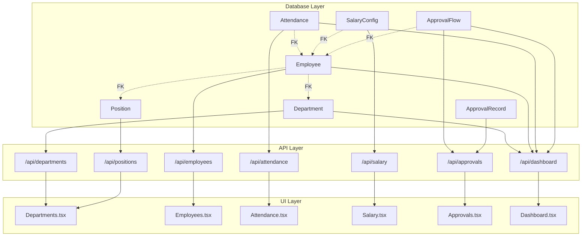
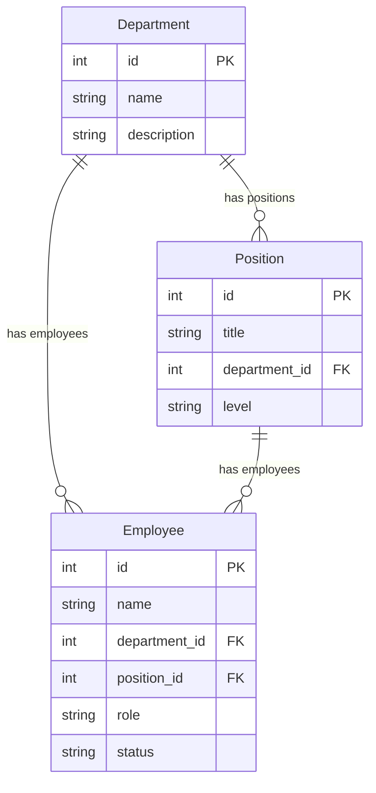
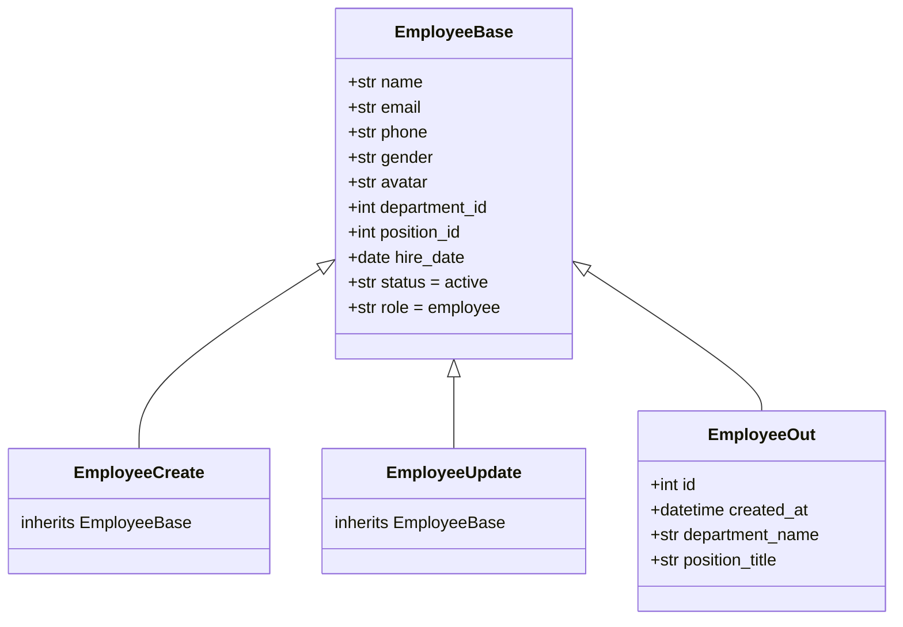
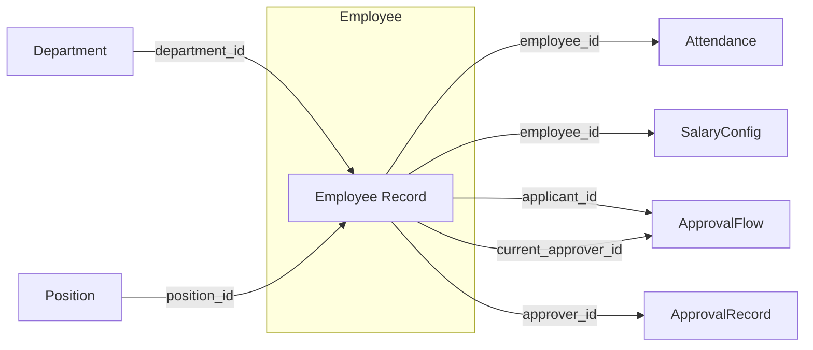
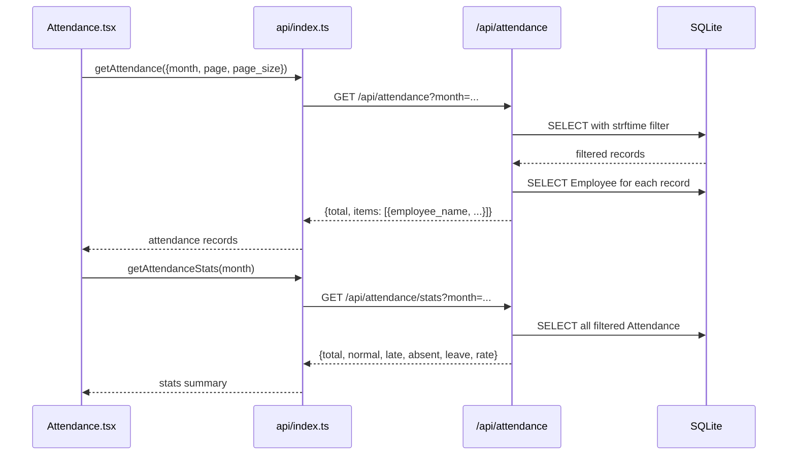
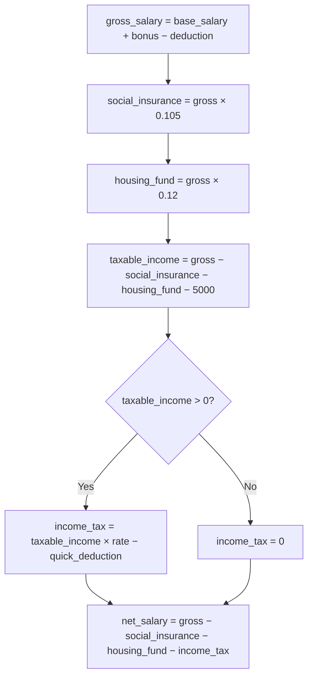
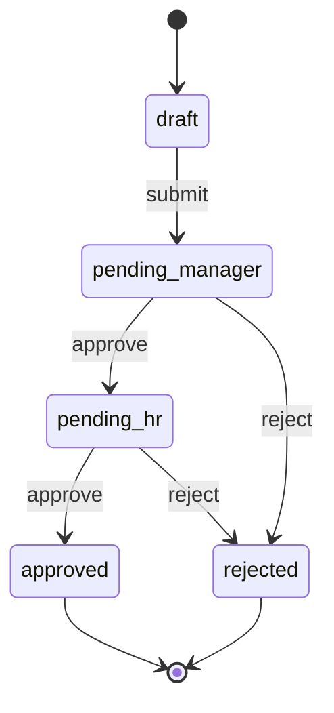
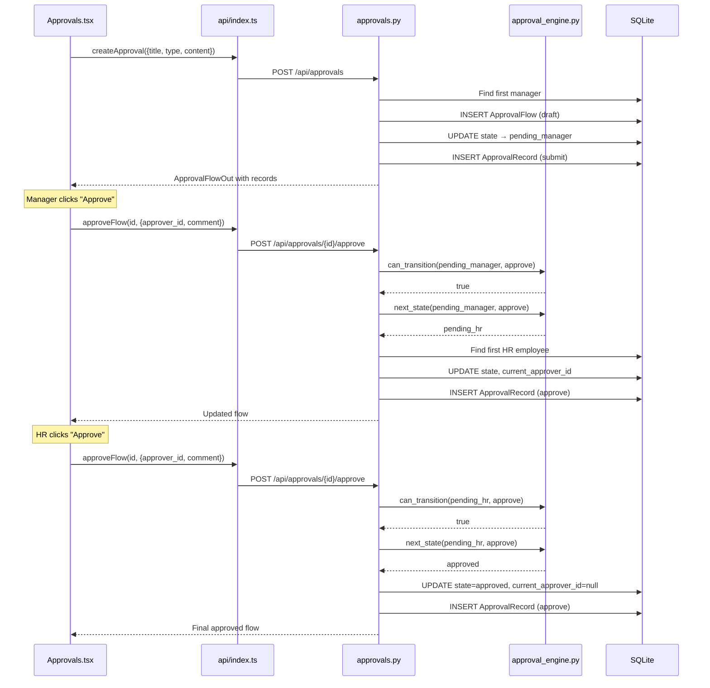
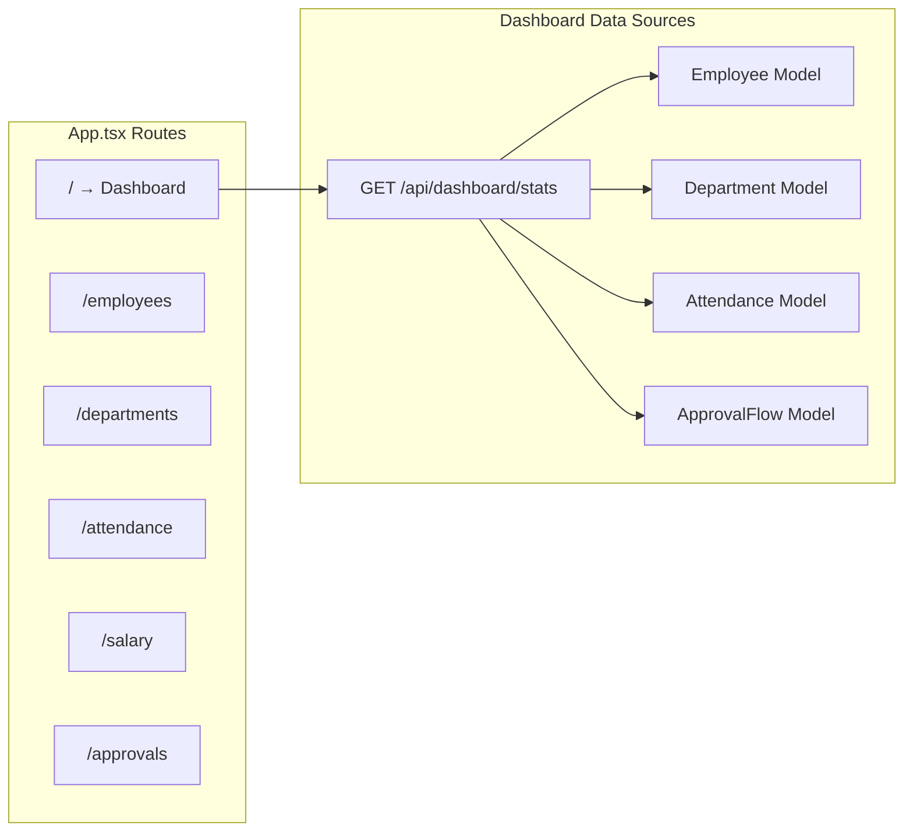
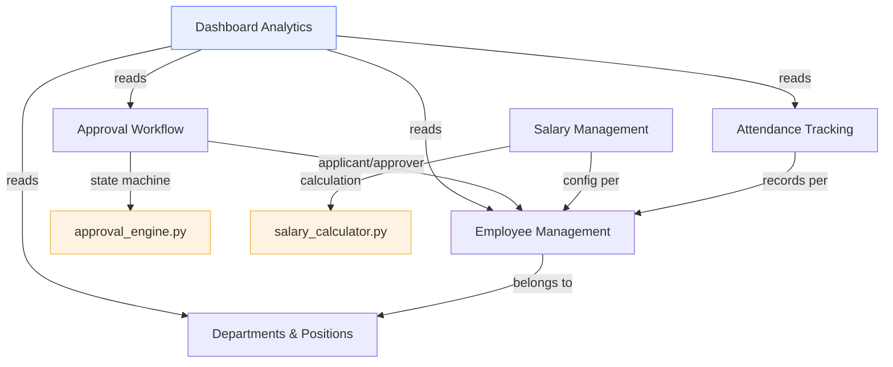

# 3、Business Modules & Implementation

<details>
<summary>Related Source Files</summary>

- backend/models.py
- backend/schemas.py
- backend/routers/departments.py
- backend/routers/positions.py
- backend/routers/employees.py
- backend/routers/attendance.py
- backend/routers/salary.py
- backend/routers/approvals.py
- backend/routers/dashboard.py
- backend/services/salary_calculator.py
- backend/services/approval_engine.py
- backend/seed.py
- frontend/src/api/index.ts
- frontend/src/pages/Departments.tsx
- frontend/src/pages/Employees.tsx
- frontend/src/pages/Attendance.tsx
- frontend/src/pages/Salary.tsx
- frontend/src/pages/Approvals.tsx
- frontend/src/pages/Dashboard.tsx
- frontend/src/App.tsx
- frontend/src/stores/appStore.ts

</details>

## Overview

The HRMS system implements six interconnected business modules that collectively deliver a complete human resource management workflow. Each module follows a consistent three-layer pattern: **SQLAlchemy ORM model** → **FastAPI router with Pydantic schemas** → **React page with API client**. The Employee entity serves as the gravitational center, linking to Department, Position, Attendance, SalaryConfig, and ApprovalFlow through foreign key relationships. This document traces the data flow from database tables through API endpoints to UI components, revealing how the modules interconnect and where the critical business logic resides.



---

## Organization Management (Departments & Positions)

The organization management module establishes the structural foundation of the HRMS — the department and position hierarchy that all other modules reference. Departments define business units; positions define functional roles within those units; together they form the three-level organizational hierarchy (Department → Position → Employee).

### Backend: Department CRUD

The [`Department`](backend/models.py:7) model defines two key relationships: `employees` and `positions`, both via SQLAlchemy `relationship()` with `back_populates`. The [`DepartmentOut`](backend/schemas.py:17) schema enriches the base model with a computed `employee_count` field — this value is not persisted but calculated at query time by counting employees with a matching `department_id`.

The [`departments router`](backend/routers/departments.py:1) implements four endpoints under `/api/departments`:

| Method | Endpoint | Behavior |
|--------|----------|----------|
| GET | `/api/departments` | Returns all departments with computed `employee_count` |
| POST | `/api/departments` | Creates department, returns `employee_count=0` |
| PUT | `/api/departments/{id}` | Updates name/description, recalculates `employee_count` |
| DELETE | `/api/departments/{id}` | Deletes department (no cascade guard) |

The [`employee_count` computation](backend/routers/departments.py:15) uses a direct `db.query(Employee).filter(Employee.department_id == dept.id).count()` for each department — an N+1 query pattern suitable for the small dataset scale but worth noting for larger deployments.

### Backend: Position CRUD with Department Filtering

The [`Position`](backend/models.py:19) model carries a `ForeignKey("departments.id")` and a `department` relationship for back-references. The [`PositionOut`](backend/schemas.py:38) schema includes a computed `department_name` field resolved by querying the related [`Department`](backend/models.py:7) at response time.

The [`positions router`](backend/routers/positions.py:1) exposes CRUD at `/api/positions` with optional `department_id` query parameter for filtering. Each response enriches the position with its parent department's name — another N+1 pattern where [`list_positions`](backend/routers/positions.py:11) issues a separate `db.query(Department)` per position.

### Frontend: Unified Department UI

[`Departments.tsx`](frontend/src/pages/Departments.tsx:1) renders departments as a card grid. Each card displays the department name, description, and employee count with edit/delete actions. A modal form (via [`ModalShell`](frontend/src/pages/Departments.tsx:160)) handles both create and update operations using the same form state.

The page loads data through [`getDepartments()`](frontend/src/api/index.ts:6) and renders three `StatCard` components summarizing department count, total employees, and description coverage. The component uses `useCallback` for the `loadData` function to prevent unnecessary re-fetches.

### Data Relationships



The three-level hierarchy — Department → Position → Employee — means every employee belongs to both a department and a position, and every position belongs to a department. Deleting a department without handling its child positions or employees would leave orphaned foreign keys, a trade-off accepted in this demo system.

---

## Employee Management

Employee is the central entity of the HRMS. Every other business module — attendance tracking, salary configuration, approval workflow — references an employee record. This module provides the primary data management interface for the entire workforce.

### Backend: CRUD with Enrichment Pattern

The [`employees router`](backend/routers/employees.py:1) defines a private helper [`_to_out()`](backend/routers/employees.py:10) that converts an `Employee` ORM object into an `EmployeeOut` schema by resolving the employee's `department_name` and `position_title` through separate queries. This enrichment pattern is used in every endpoint response.

The [`list_employees`](backend/routers/employees.py:28) endpoint supports three filter parameters and pagination:

- **`search`**: Name substring match via `Employee.name.contains(search)`
- **`department_id`**: Exact foreign key match
- **`status`**: Exact string match (`active`/`inactive`)
- **Pagination**: `page` (default 1) and `page_size` (default 20, max 100) via offset/limit

The response follows the project's standard list format: `{"total": <count>, "items": [...]}`.

### Schema: EmployeeOut Enrichment

[`EmployeeOut`](backend/schemas.py:66) extends [`EmployeeBase`](backend/schemas.py:48) with `id`, `created_at`, `department_name`, and `position_title`. The `role` field (`employee`/`manager`/`hr`) and `status` field (`active`/`inactive`) are declared in `EmployeeBase` with defaults, making them part of every create/update payload.



### Frontend: Searchable, Filterable Employee Directory

[`Employees.tsx`](frontend/src/pages/Employees.tsx:1) provides a full-featured employee directory with:

- **Search bar**: Text input filtering by name, resets pagination on change
- **Department filter**: `<select>` dropdown populated from [`getDepartments()`](frontend/src/api/index.ts:6)
- **Pagination**: Client-side page controls with `pageSize=10`
- **Create/Edit modal**: Form with fields for all `Employee` attributes, including department and position selectors (positions filtered by selected department via [`filteredPositions`](frontend/src/pages/Employees.tsx:139))

The component loads departments and positions once on mount, while employees are re-fetched whenever search, filter, or page changes. The [`handleSubmit`](frontend/src/pages/Employees.tsx:112) function handles both create and update paths, casting `department_id` and `position_id` to numbers or `null`.

### Employee as Central Entity



The Employee model participates in five foreign key relationships — making it the most connected entity. The `_to_out()` enrichment pattern exists precisely because the Employee's relational data (department name, position title) is needed by every consumer of the employee API.

---

## Attendance Management

The attendance module tracks daily check-in/check-out records for every employee, providing month-level statistics for workforce monitoring. Its data is seeded automatically on first startup and powers the attendance rate metric on the dashboard.

### Backend: List and Stats Endpoints

The [`attendance router`](backend/routers/attendance.py:1) exposes two endpoints under `/api/attendance`:

| Endpoint | Purpose |
|----------|---------|
| `GET /api/attendance` | Paginated list with `employee_id` and `month` filters |
| `GET /api/attendance/stats` | Aggregated statistics for a given month |

The [`list_attendance`](backend/routers/attendance.py:11) function uses SQLite's `strftime("%Y-%m", date)` for month filtering — a SQLite-specific pattern that leverages the database engine's date function rather than Python-level filtering. Records are ordered by date descending.

The [`attendance_stats`](backend/routers/attendance.py:37) endpoint computes counts for each status category (`normal`, `late`, `absent`, `leave`) and derives the attendance rate as `normal / total * 100`. All computation is done in-memory after fetching the filtered records.

### Data Model and Seeding

The [`Attendance`](backend/models.py:54) model stores `employee_id`, `date`, `check_in`, `check_out`, and `status`. The [`seed.py`](backend/seed.py:89) generates attendance data for the current month using a weighted random distribution:

| Status | Weight | Probability |
|--------|--------|-------------|
| `normal` | 80 | 80% |
| `late` | 10 | 10% |
| `absent` | 5 | 5% |
| `leave` | 5 | 5% |

Weekend dates (`weekday() >= 5`) are skipped. For `normal` status, check-in times are randomly set between 08:50–08:59; for `late`, between 09:10–09:30; for `absent`/`leave`, check-in and check-out are `None`.

### Frontend: Records Table with Statistics

[`Attendance.tsx`](frontend/src/pages/Attendance.tsx:1) renders attendance data in a data table with color-coded status badges:

- **Normal**: Emerald background (`bg-emerald-50 text-emerald-700`)
- **Late**: Amber background (`bg-amber-50 text-amber-700`)
- **Absent**: Rose background (`bg-rose-50 text-rose-700`)
- **Leave**: Slate background (`bg-slate-100 text-slate-700`)

The page fetches both records and stats in parallel via `Promise.all([getAttendance(...), getAttendanceStats(...)])`. A month picker (`<input type="month">`) allows switching the view period. Three `StatCard` components display total days, normal count, and attendance rate.

### API Functions

The frontend uses two dedicated API functions from [`api/index.ts`](frontend/src/api/index.ts:26):

- [`getAttendance(params)`](frontend/src/api/index.ts:26) → `GET /api/attendance` with query params
- [`getAttendanceStats(month)`](frontend/src/api/index.ts:27) → `GET /api/attendance/stats`



---

## Salary Management

The salary module implements China mainland's individual income tax calculation system with progressive tax brackets. It is the most algorithmically complex module, separating calculation logic into a dedicated service layer.

### Backend: Config and Calculate Endpoints

The [`salary router`](backend/routers/salary.py:1) provides three endpoints under `/api/salary`:

| Endpoint | Method | Purpose |
|----------|--------|---------|
| `/api/salary/config/{employee_id}` | GET | Retrieve or auto-create SalaryConfig |
| `/api/salary/config/{employee_id}` | PUT | Update or create SalaryConfig |
| `/api/salary/calculate` | POST | Compute salary breakdown |

The [`get_salary_config`](backend/routers/salary.py:12) endpoint implements an auto-creation pattern: if no `SalaryConfig` exists for the given employee, it creates one with default values and returns it. This ensures every employee always has a salary configuration available.

### SalaryConfig Model

The [`SalaryConfig`](backend/models.py:67) model stores per-employee salary parameters with sensible defaults:

| Field | Type | Default | Description |
|-------|------|---------|-------------|
| `base_salary` | Float | 0 | Monthly base salary |
| `housing_fund_rate` | Float | 0.12 | Housing provident fund rate (12%) |
| `social_insurance_rate` | Float | 0.105 | Social insurance rate (10.5%) |
| `bonus` | Float | 0 | Additional bonus |
| `deduction` | Float | 0 | Pre-tax deduction |

The `employee_id` field has a `unique=True` constraint, enforcing a one-to-one relationship between Employee and SalaryConfig.

### Salary Calculation Engine

The [`salary_calculator.py`](backend/services/salary_calculator.py:1) service implements China mainland's seven-tier progressive tax system. The calculation flow proceeds through five stages:



The [`TAX_BRACKETS`](backend/services/salary_calculator.py:4) constant defines the seven progressive tiers:

| Taxable Income (¥) | Rate | Quick Deduction (¥) |
|---------------------|------|---------------------|
| ≤ 3,000 | 3% | 0 |
| ≤ 12,000 | 10% | 210 |
| ≤ 25,000 | 20% | 1,410 |
| ≤ 35,000 | 25% | 2,660 |
| ≤ 55,000 | 30% | 4,410 |
| ≤ 80,000 | 35% | 7,160 |
| > 80,000 | 45% | 15,160 |

The [`calculate_tax`](backend/services/salary_calculator.py:17) function iterates through brackets and returns `round(taxable_income * rate - deduction, 2)`. The [`TAX_THRESHOLD`](backend/services/salary_calculator.py:14) is set to ¥5,000 (China's standard individual income tax threshold).

The [`calculate_salary`](backend/services/salary_calculator.py:26) function produces a [`SalaryCalculateResult`](backend/schemas.py:120) containing both the numeric breakdown and a `details` array of labeled items for UI rendering, with deductions shown as negative values for visual clarity.

### Frontend: Interactive Salary Calculator

[`Salary.tsx`](frontend/src/pages/Salary.tsx:1) provides a two-panel layout:

**Left panel — Inputs**: Employee selector, base salary, bonus, deduction fields, plus range sliders for housing fund rate (5%–12%) and social insurance rate (8%–12%). Selecting an employee auto-loads their [`SalaryConfig`](frontend/src/api/index.ts:30) via `getSalaryConfig()`.

**Right panel — Results**: A gradient hero card shows the net salary in large typography, followed by sub-cards for gross salary, income tax, social insurance, and housing fund. A [`PieChart`](frontend/src/pages/Salary.tsx:3) (via Recharts) visualizes the salary composition with color-coded segments.

The calculation is debounced at 250ms — any change to the input fields triggers [`calculate`](frontend/src/pages/Salary.tsx:44) after a brief delay, preventing excessive API calls during rapid input changes.

---

## Approval Workflow

The approval workflow module implements a finite state machine that governs the lifecycle of approval requests. It is the only module with a dedicated service engine ([`approval_engine.py`](backend/services/approval_engine.py:1)), reflecting the business complexity of state transitions and role-based routing.

### Backend: State Machine Engine

The [`approval_engine.py`](backend/services/approval_engine.py:1) defines the complete state transition map:



The [`VALID_TRANSITIONS`](backend/services/approval_engine.py:11) dictionary encodes this as:

```
draft         → {submit: pending_manager}
pending_manager → {approve: pending_hr, reject: rejected}
pending_hr    → {approve: approved, reject: rejected}
approved      → {}  (terminal)
rejected      → {}  (terminal)
```

Two functions implement the state machine contract:
- [`can_transition(state, action)`](backend/services/approval_engine.py:20) → checks if the action is valid from the current state
- [`next_state(state, action)`](backend/services/approval_engine.py:25) → returns the target state or `None`

### Backend: Approval Router Endpoints

The [`approvals router`](backend/routers/approvals.py:1) exposes five endpoints under `/api/approvals`:

| Method | Endpoint | Behavior |
|--------|----------|----------|
| GET | `/api/approvals` | List with role/status/applicant filtering |
| GET | `/api/approvals/{id}` | Detail with full records |
| POST | `/api/approvals` | Create and auto-submit |
| POST | `/api/approvals/{id}/approve` | Approve with state transition |
| POST | `/api/approvals/{id}/reject` | Reject with state transition |

The [`create_approval`](backend/routers/approvals.py:63) endpoint performs two operations atomically:
1. Creates the `ApprovalFlow` in `draft` state with the first manager as `current_approver_id`
2. Immediately transitions to `pending_manager` and creates a `submit` `ApprovalRecord`

The [`approve`](backend/routers/approvals.py:89) endpoint validates the transition via `can_transition()`, then:
- Transitions to the next state
- Creates an `approve` `ApprovalRecord`
- If the new state is `pending_hr`, finds an HR employee and assigns them as `current_approver_id`
- If the new state is `approved`, clears `current_approver_id` to `None`

The [`reject`](backend/routers/approvals.py:118) endpoint transitions to `rejected` and clears `current_approver_id`.

### Data Model: ApprovalFlow and ApprovalRecord

[`ApprovalFlow`](backend/models.py:81) tracks the approval request with `title`, `type` (leave/salary_adjust/other), `applicant_id`, `state`, `current_approver_id`, and a JSON `content` field for flexible request data. The `records` relationship uses `cascade="all, delete-orphan"` to ensure records are deleted when the flow is deleted.

[`ApprovalRecord`](backend/models.py:99) logs each action with `approver_id`, `action` (submit/approve/reject), `comment`, and `created_at`. The `_to_out()` helper in the router enriches both the flow and its records with employee names.

### Frontend: Role-Aware Approval Interface

[`Approvals.tsx`](frontend/src/pages/Approvals.tsx:1) uses the [`useAppStore`](frontend/src/stores/appStore.ts:1) Zustand store to access `currentRole`, which determines what the user sees:

- **Tab "My Applications"**: Shows all approvals (default view)
- **Tab "Pending My Approval"**: Filters by `pending_manager` (if role=manager) or `pending_hr` (if role=hr)
- **Tab "All Approvals"**: Unfiltered list

The [`canApprove`](frontend/src/pages/Approvals.tsx:140) logic enforces role-based action visibility:
- Managers can approve/reject only when `state === "pending_manager"`
- HR can approve/reject only when `state === "pending_hr"`

The detail view shows the approval timeline with all `ApprovalRecord` entries, and action buttons (Approve/Reject) appear only when the current user has the appropriate role. Creating a new approval opens a form modal where the `type` selector (leave/salary_adjust/other) dynamically changes the form fields.



---

## Dashboard Analytics

The dashboard module serves as the system's landing page (defined as the `index` route in [`App.tsx`](frontend/src/App.tsx:15)). It aggregates metrics from multiple modules into a single overview, providing the home page experience that users see immediately after loading the application.

### Backend: Cross-Module Aggregation

The [`dashboard router`](backend/routers/dashboard.py:1) exposes a single endpoint `GET /api/dashboard/stats` that queries four different models to build the [`DashboardStats`](backend/schemas.py:171) response:

| Metric | Source Query |
|--------|-------------|
| `total_employees` | `db.query(Employee).count()` |
| `active_employees` | `db.query(Employee).filter(status == "active").count()` |
| `department_count` | `db.query(Department).count()` |
| `pending_approvals` | `db.query(ApprovalFlow).filter(state.in_(["pending_manager", "pending_hr"])).count()` |
| `attendance_rate` | `normal_att / total_att * 100` from Attendance |
| `recent_approvals` | Last 5 ApprovalFlow records with enriched data |

The [`get_stats`](backend/routers/dashboard.py:11) function performs six separate database queries to assemble this data. The `recent_approvals` list is built using the same enrichment pattern as the approvals module — resolving applicant and approver names from the Employee table.

### Frontend: Metric Cards and Approval Table

[`Dashboard.tsx`](frontend/src/pages/Dashboard.tsx:1) renders four `StatCard` components in a responsive grid:

1. **Total Employees** (blue) — with department count hint
2. **Active Employees** (green) — with active percentage (computed as [`healthRatio`](frontend/src/pages/Dashboard.tsx:47))
3. **Attendance Rate** (amber) — current month percentage
4. **Pending Approvals** (rose) — awaiting action count

Below the metrics, a two-column layout shows:
- **Recent Approvals table** — listing the latest 5 approval requests with type, applicant, status badge, and date
- **Operational Notes panel** — summary cards for workforce coverage percentage and department count

The dashboard fetches data on mount via `Promise.all([getDashboardStats(), getApprovals({page:1, page_size:6})])`, loading both the aggregated stats and a separate approvals list for the recent approvals table.

### Role-Aware Display Context

While the dashboard itself does not filter data by role, the broader application context is role-aware. The [`currentRole`](frontend/src/stores/appStore.ts:11) from the Zustand store is initialized from `localStorage.getItem('hrms-role')` with a fallback to `'employee'`. This role persists across sessions and is used by other modules (notably Approvals) to adapt their behavior.

### Dashboard as System Entry Point



The dashboard's cross-module aggregation makes it both the most read-heavy endpoint (six queries per request) and the most user-facing page. Its role as the index route means every application visit triggers this aggregation, which is acceptable at the demo scale but would benefit from caching in production.

---

## Cross-Module Data Flow Summary

All six business modules share a common data flow architecture and are connected through the Employee entity. This section summarizes the key patterns and interconnections.

### Shared Implementation Patterns

**Enrichment Pattern**: Every list/detail endpoint that returns foreign-key data enriches the response by querying related entities. The [`_to_out()`](backend/routers/employees.py:10) helper (employees), inline construction (departments, positions), and the dashboard's inline assembly all follow this pattern — trading query efficiency for simplicity.

**Auto-Creation Pattern**: The [`get_salary_config`](backend/routers/salary.py:12) endpoint creates a default `SalaryConfig` on first access rather than returning 404. This pattern eliminates the need for a separate "initialize salary config" step.

**State Machine Pattern**: The approval workflow's [`VALID_TRANSITIONS`](backend/services/approval_engine.py:11) dictionary decouples transition logic from the router, making the state machine testable in isolation and easy to extend.

### Module Dependency Map



### Key Design Observations

1. **Employee as foreign key hub**: Five tables reference the Employee model, making it the single most critical entity. Any schema change to Employee has cascading implications.

2. **Service layer separation**: Only the salary and approval modules extract business logic into dedicated services (`salary_calculator.py` and `approval_engine.py`). The remaining modules embed all logic directly in routers — a reasonable choice for simple CRUD but one that would need refactoring as complexity grows.

3. **Seeding as documentation**: The [`seed.py`](backend/seed.py:1) file serves as living documentation of the data model's expected shape, demonstrating how departments, positions, employees, attendance records, salary configs, and approval flows interconnect.

4. **Frontend consistency**: All six pages follow the same structural template — `PageHeader` with `StatCard` row, followed by a `Panel` with the main content. This consistency reduces cognitive load for developers navigating between modules.
