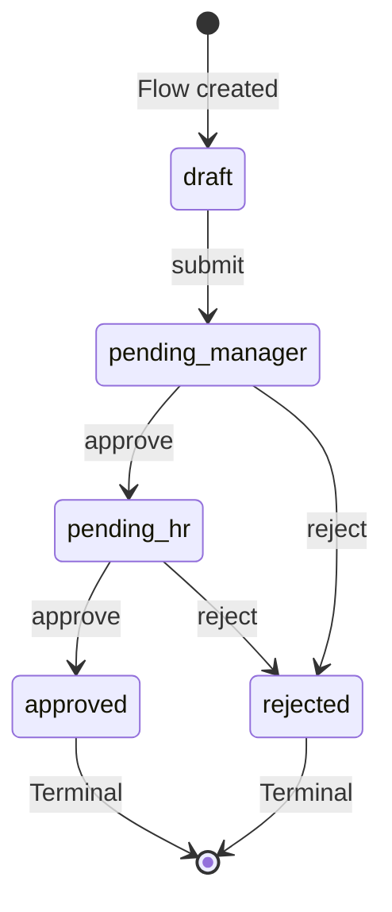
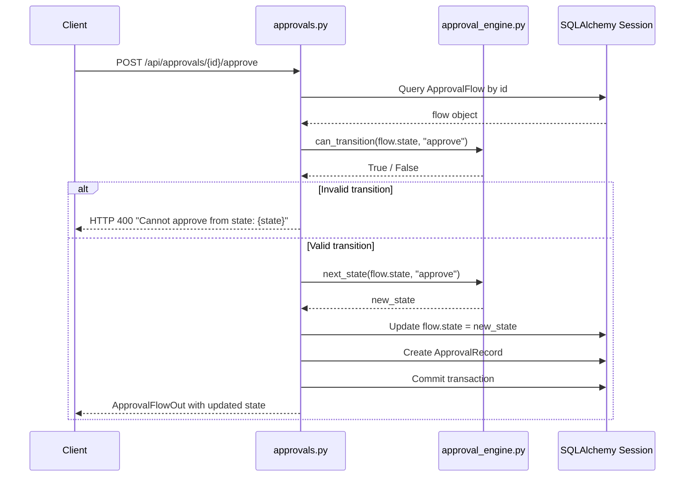
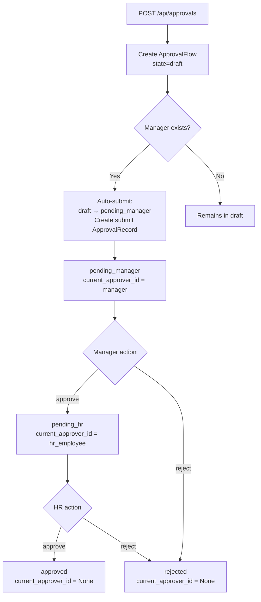
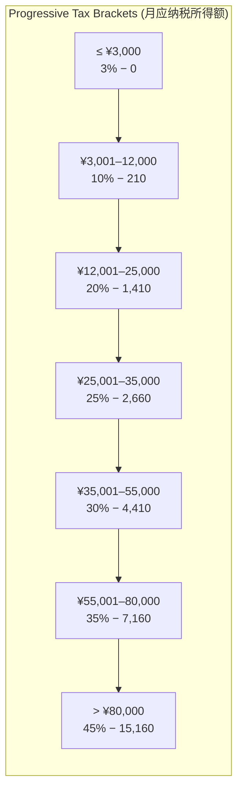
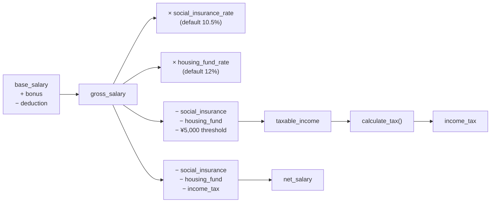
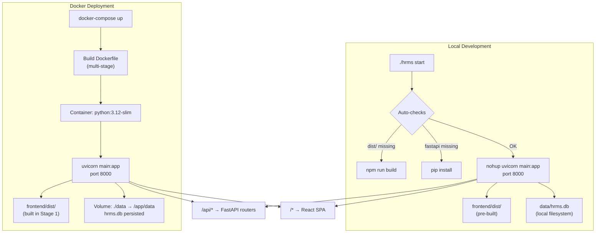
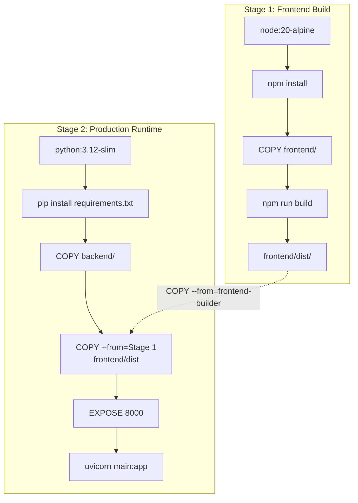
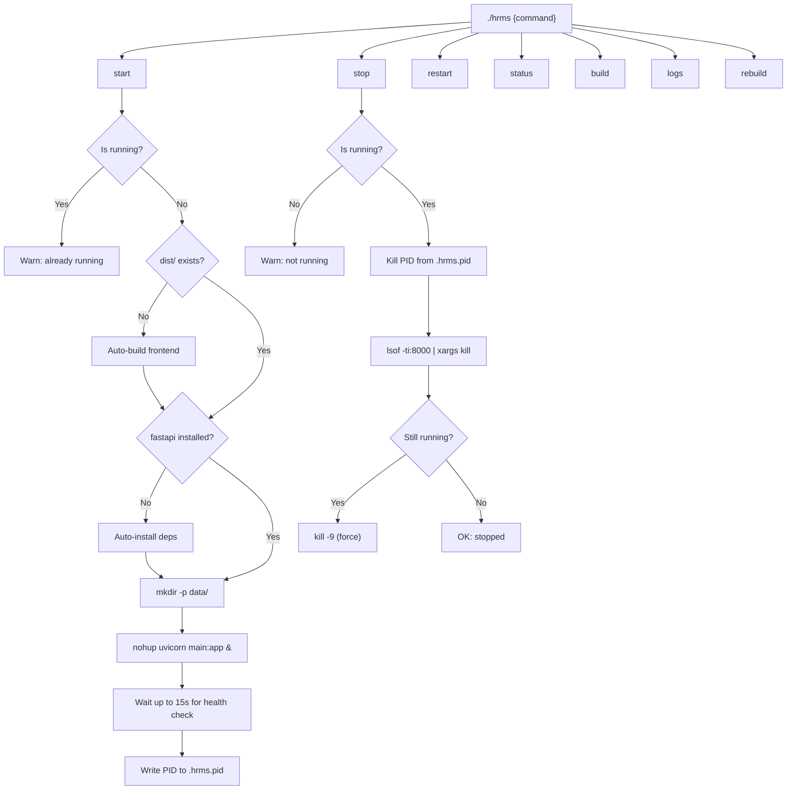
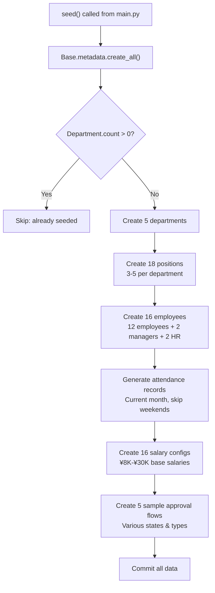

# Core Services & Deployment

<details>
<summary>Related Source Files</summary>

- backend/services/approval_engine.py
- backend/routers/approvals.py
- backend/services/salary_calculator.py
- backend/routers/salary.py
- backend/schemas.py
- backend/models.py
- backend/database.py
- backend/seed.py
- backend/main.py
- Dockerfile
- docker-compose.yml
- hrms
- .dockerignore

</details>

## Overview

The HRMS system's technical sophistication resides in two domain-specific service engines and a production-ready deployment infrastructure. The **Approval State Machine Engine** implements a finite state machine pattern that governs the multi-stage approval workflow — enforcing valid transitions between `draft → pending_manager → pending_hr → approved/rejected` states with full audit trail recording. The **Salary Calculation Engine** encodes China mainland's progressive individual income tax system with 7 brackets, computing gross-to-net salary pipelines that account for social insurance, housing fund, and quick deduction formulas. The **Deployment Infrastructure** provides a multi-stage Docker build, a custom bash management script with PID-based process control, and auto-seeding demo data — making the system demo-ready within minutes.

These components represent the deepest technical layers of HRMS: where business rules become code, where domain logic requires mathematical precision, and where operational reliability depends on careful infrastructure design.

## Core Directory Structure

```
hrms/
├─ backend/
│  ├─ services/                  # Domain engines: business rule implementations
│  │  ├─ approval_engine.py      # State machine: VALID_TRANSITIONS, can_transition, next_state
│  │  └─ salary_calculator.py    # Tax engine: TAX_BRACKETS, calculate_tax, calculate_salary
│  ├─ routers/
│  │  ├─ approvals.py            # Approval API: state-guarded endpoints with engine integration
│  │  └─ salary.py               # Salary API: config CRUD + calculate endpoint
│  ├─ models.py                  # ORM: ApprovalFlow, ApprovalRecord, SalaryConfig
│  ├─ schemas.py                 # Pydantic: ApprovalFlowOut, SalaryCalculateRequest/Result
│  ├─ database.py                # SQLAlchemy engine + session factory, HRMS_DATA_DIR config
│  ├─ seed.py                    # Demo data seeder: 5 depts, 18 positions, 16 employees
│  └─ main.py                    # App entry: table creation, seeding, SPA static serving
├─ Dockerfile                    # Multi-stage: node:20-alpine → python:3.12-slim
├─ docker-compose.yml            # Single-service orchestration with volume mount
└─ hrms                          # Bash management script: start/stop/restart/status/build/logs
```

## Approval State Machine Engine

### Design Pattern & State Transition Model

The approval engine at [`approval_engine.py`](backend/services/approval_engine.py:1) implements the **State Machine pattern** using a declarative transition table. This is a classic application of the finite state machine (FSM) design pattern, where the system's behavior is determined by a lookup table rather than procedural conditionals.



The transition table [`VALID_TRANSITIONS`](backend/services/approval_engine.py:11) is a nested dictionary where each outer key is a **current state**, and the inner dictionary maps **actions** to **resulting states**:

```python
VALID_TRANSITIONS = {
    "draft": {"submit": "pending_manager"},
    "pending_manager": {"approve": "pending_hr", "reject": "rejected"},
    "pending_hr": {"approve": "approved", "reject": "rejected"},
    "approved": {},    # Terminal: no valid actions
    "rejected": {},    # Terminal: no valid actions
}
```

**Design Rationale**: The empty dictionaries for `approved` and `rejected` encode terminal states — any action attempted from these states will fail validation. This declarative approach offers three key advantages:

1. **Single Source of Truth**: All state transitions are defined in one data structure, eliminating scattered conditional logic
2. **O(1) Validation**: Both `can_transition()` and `next_state()` perform constant-time dictionary lookups
3. **Extensibility**: New states or transitions can be added by modifying the dictionary without touching the function logic

### API Functions & Validation

The engine exposes two pure functions with no side effects:

| Function | Signature | Purpose | Complexity |
|----------|-----------|---------|------------|
| [`can_transition`](backend/services/approval_engine.py:20) | `(current_state: str, action: str) -> bool` | Validates if an action is allowed from current state | O(1) dict lookup |
| [`next_state`](backend/services/approval_engine.py:25) | `(current_state: str, action: str) -> str \| None` | Returns the resulting state for a valid action | O(1) dict lookup |

Both functions follow the same lookup pattern — `VALID_TRANSITIONS.get(current_state, {})` returns the action→state map for the current state, with an empty dict default for unknown states. This means:

- `can_transition("approved", "approve")` → `False` (terminal state, no transitions)
- `can_transition("draft", "approve")` → `False` (only "submit" is valid from draft)
- `next_state("pending_manager", "approve")` → `"pending_hr"`
- `next_state("unknown_state", "submit")` → `None` (graceful handling of invalid states)

**Separation of Concerns**: The engine deliberately does not persist state changes — it only validates and computes. The router layer is responsible for applying transitions and creating audit records, maintaining a clean boundary between business rules and I/O operations.

### Router Integration

The [`approvals.py`](backend/routers/approvals.py:1) router integrates the state machine as a **guard layer** before any state mutation. Every state-changing endpoint follows the same pattern:



The [`approve`](backend/routers/approvals.py:89) endpoint (line 89-115) demonstrates the full pattern:

1. **Fetch** the flow from database, return 404 if not found
2. **Guard** with `can_transition(flow.state, "approve")`, return HTTP 400 if invalid
3. **Compute** new state with `next_state(flow.state, "approve")`
4. **Update** `flow.state` and `flow.updated_at`
5. **Record** the transition as an `ApprovalRecord`
6. **Route** — if new state is `pending_hr`, find an HR employee and set `current_approver_id`; if `approved`, clear `current_approver_id`
7. **Commit** and return the updated flow

The [`reject`](backend/routers/approvals.py:118) endpoint (line 118-137) follows the same guard pattern but always transitions to `"rejected"` directly (bypassing `next_state` since rejection is deterministic from any reviewable state). This is a minor design inconsistency — the reject endpoint hardcodes `"rejected"` instead of calling `next_state(flow.state, "reject")`, which would produce the same result but maintain a more consistent pattern. The current approach is defensible since rejection always leads to the same terminal state regardless of the current review stage.

### Business Flow: Creation to Resolution

The complete approval lifecycle includes an important **auto-submit** behavior during creation:



The [`create_approval`](backend/routers/approvals.py:63) endpoint (line 63-86) performs auto-submission:
- Creates the flow in `draft` state
- Finds the first employee with `role == "manager"` as the initial approver
- Immediately transitions to `pending_manager` with a submit `ApprovalRecord`
- This means newly created approvals are never visible in `draft` state unless no manager exists in the system

**Cross-reference with Salary Engine**: The approval workflow supports a `salary_adjust` type (see [`ApprovalFlowCreate.type`](backend/schemas.py:133)) that bridges the two core engines. When a salary adjustment request is submitted, it traverses the same state machine as leave and equipment requests, but the business context differs — the `content` field carries `adjust_amount` and `reason` data that would feed into the salary engine's `bonus` or `base_salary` parameters upon final approval.

### Record Keeping & Audit Trail

Every state transition creates an [`ApprovalRecord`](backend/models.py:99) (line 99-110) with four mandatory fields:

| Field | Type | Purpose |
|-------|------|---------|
| `flow_id` | Integer (FK) | Links to the parent ApprovalFlow |
| `approver_id` | Integer (FK) | The employee who performed the action |
| `action` | String(20) | One of: `"submit"`, `"approve"`, `"reject"` |
| `comment` | Text (nullable) | Free-text explanation from the approver |

The [`ApprovalFlow`](backend/models.py:81) model (line 81-96) maintains a one-to-many relationship via `records` with `cascade="all, delete-orphan"`, ensuring records are tied to the flow lifecycle. The [`_to_out`](backend/routers/approvals.py:12) helper function (line 12-36) enriches each record with `approver_name` by joining against the Employee table, producing the [`ApprovalRecordOut`](backend/schemas.py:140) schema with a human-readable audit trail.

---

## Salary Calculation Engine

### China Mainland Individual Income Tax System

The salary engine at [`salary_calculator.py`](backend/services/salary_calculator.py:1) implements China's **progressive tax rate system** (超额累进税率) defined by the State Taxation Administration. The [`TAX_BRACKETS`](backend/services/salary_calculator.py:4) array defines 7 tiers:



Each bracket tuple `(upper_bound, rate, quick_deduction)` encodes the **quick deduction formula** (速算扣除数), which simplifies progressive tax calculation to a single multiplication and subtraction:

```
tax = taxable_income × rate − quick_deduction
```

Without the quick deduction, calculating progressive tax would require splitting income across brackets and summing each tier's tax — an O(n) operation with 7 iterations. The quick deduction pre-computes the cumulative tax from all lower brackets, collapsing the entire calculation into O(1) per bracket check.

| Bracket | Upper Bound (¥) | Rate | Quick Deduction (¥) | Tax at boundary |
|---------|-----------------|------|---------------------|-----------------|
| 1 | 3,000 | 3% | 0 | 90.00 |
| 2 | 12,000 | 10% | 210 | 990.00 |
| 3 | 25,000 | 20% | 1,410 | 3,590.00 |
| 4 | 35,000 | 25% | 2,660 | 6,090.00 |
| 5 | 55,000 | 30% | 4,410 | 12,090.00 |
| 6 | 80,000 | 35% | 7,160 | 20,840.00 |
| 7 | ∞ | 45% | 15,160 | — |

The [`TAX_THRESHOLD`](backend/services/salary_calculator.py:14) constant of ¥5,000 represents the 个税起征点 — the monthly income exemption below which no tax is owed.

### Tax Calculation Algorithm

The [`calculate_tax`](backend/services/salary_calculator.py:17) function (line 17-23) implements a linear scan through the bracket array:

```python
def calculate_tax(taxable_income: float) -> float:
    if taxable_income <= 0:
        return 0.0
    for upper, rate, deduction in TAX_BRACKETS:
        if taxable_income <= upper:
            return round(taxable_income * rate - deduction, 2)
    return 0.0
```

**Algorithm Analysis**:
- **Time complexity**: O(n) where n=7 (number of brackets) — at most 7 comparisons
- **Space complexity**: O(1) — no additional allocations
- **Edge cases**: Returns 0.0 for non-positive taxable income; the `float('inf')` upper bound in the last bracket guarantees all positive values will match
- **Precision**: `round(..., 2)` ensures cent-level precision per Chinese tax rounding conventions

The unreachable `return 0.0` at line 23 is a defensive fallback — since the last bracket's upper bound is `float('inf')`, the loop will always return before exiting.

**Worked Example**: For a taxable income of ¥20,000:
- Bracket check: 20,000 ≤ 25,000 → matches 3rd bracket (rate=20%, deduction=1,410)
- Tax = 20,000 × 0.20 − 1,410 = **¥2,590.00**
- Verification without quick deduction: 3,000×3% + (12,000−3,000)×10% + (20,000−12,000)×20% = 90 + 900 + 1,600 = **¥2,590.00** ✓

### Salary Calculation Pipeline

The [`calculate_salary`](backend/services/salary_calculator.py:26) function (line 26-57) implements the complete gross-to-net pipeline:



The calculation steps in order:

1. **Gross salary**: `base_salary + bonus - deduction` — the total pre-tax earnings
2. **Social insurance** (五险个人部分): `gross_salary × social_insurance_rate` (default 10.5%) — covers pension, medical, unemployment, work injury, and maternity insurance personal contributions
3. **Housing provident fund** (住房公积金): `gross_salary × housing_fund_rate` (default 12%) — the employee's contribution to the housing fund
4. **Taxable income** (应纳税所得额): `gross_salary - social_insurance - housing_fund - 5000` — income after statutory deductions and the tax threshold
5. **Income tax**: computed via [`calculate_tax()`](backend/services/salary_calculator.py:17) through progressive brackets
6. **Net salary** (到手工资): `gross_salary - social_insurance - housing_fund - income_tax`

**Worked Example**: For an employee with `base_salary=15000`, `bonus=1000`, `deduction=0`:
1. Gross salary: 15,000 + 1,000 − 0 = **¥16,000**
2. Social insurance: 16,000 × 10.5% = **¥1,680**
3. Housing fund: 16,000 × 12% = **¥1,920**
4. Taxable income: 16,000 − 1,680 − 1,920 − 5,000 = **¥7,400**
5. Income tax: 7,400 × 10% − 210 = **¥530** (2nd bracket: ≤12,000)
6. Net salary: 16,000 − 1,680 − 1,920 − 530 = **¥11,870**

The `details` array for this calculation would be: `[{gross_salary: 16000}, {social_insurance: -1680}, {housing_fund: -1920}, {taxable_income: 7400}, {income_tax: -530}, {net_salary: 11870}]`.

**Default rate rationale**: The 10.5% social insurance rate and 12% housing fund rate represent typical Chinese employer city rates (e.g., Shanghai 2024). These are configurable per [`SalaryCalculateRequest`](backend/schemas.py:113):

```python
class SalaryCalculateRequest(BaseModel):
    base_salary: float
    bonus: float = 0
    deduction: float = 0
    housing_fund_rate: float = 0.12
    social_insurance_rate: float = 0.105
```

The function returns a structured dictionary containing all intermediate values plus a `details` array:

```python
details = [
    {"label": "gross_salary", "value": gross_salary},
    {"label": "social_insurance", "value": -social_insurance},   # Negative = deduction
    {"label": "housing_fund", "value": -housing_fund},           # Negative = deduction
    {"label": "taxable_income", "value": taxable_income},         # Informational
    {"label": "income_tax", "value": -income_tax},                # Negative = deduction
    {"label": "net_salary", "value": net_salary},                 # Final take-home
]
```

The negative values for deductions enable the frontend to render a salary breakdown with visual distinction between additions and subtractions.

### API Integration

The [`salary.py`](backend/routers/salary.py:1) router exposes three endpoints:

| Method | Path | Purpose | Engine Usage |
|--------|------|---------|--------------|
| GET | `/api/salary/config/{employee_id}` | Retrieve salary configuration | None (direct DB query) |
| PUT | `/api/salary/config/{employee_id}` | Update salary configuration | None (direct DB update) |
| POST | `/api/salary/calculate` | Calculate salary from parameters | `calculate_salary()` |

The [`calculate`](backend/routers/salary.py:39) endpoint (line 39-48) is a pure computation endpoint — it takes a [`SalaryCalculateRequest`](backend/schemas.py:113) body, passes all five parameters directly to the engine, and returns the [`SalaryCalculateResult`](backend/schemas.py:120) without any database interaction. This stateless design enables real-time salary previews before committing changes to the salary config.

A notable pattern: the [`get_salary_config`](backend/routers/salary.py:11) endpoint (line 11-22) implements **lazy creation** — if no `SalaryConfig` exists for an employee, it creates one with default values (all zeros except rates: 12% housing fund, 10.5% social insurance) and persists it, ensuring every employee always has a config record.

---

## Deployment & DevOps

### Deployment Architecture Overview

The HRMS system supports two deployment modes — **local development** via the custom `hrms` script and **containerized production** via Docker:



Both modes converge on the same runtime: uvicorn serving both the API and static frontend on port 8000, with SQLite storage and auto-seeded demo data.

### Docker Multi-Stage Build

The [`Dockerfile`](Dockerfile:1) implements a two-stage build that separates the Node.js build environment from the Python runtime, minimizing the final image size:



**Stage 1** (`frontend-builder`, lines 2-7):
- Base: `node:20-alpine` — lightweight Node.js image (~50MB)
- Copies `package.json` and `package-lock.json` first for Docker layer caching — dependency changes invalidate the cache, but source code changes do not
- Runs `npm install` then `npm run build` to produce the Vite production bundle

**Stage 2** (lines 9-25):
- Base: `python:3.12-slim` — stripped Python image without build tools (~150MB vs ~1GB for full image)
- Installs backend dependencies with `--no-cache-dir` to avoid storing pip cache in the image
- Copies only the `dist/` output from Stage 1 via `COPY --from=frontend-builder`
- Exposes port 8000 and runs `uvicorn main:app`

**Image optimization**: The Node.js runtime, npm modules (~200MB), and frontend source files are all discarded after Stage 1. Only the compiled static assets (~2-5MB) survive into the final image.

**Build context optimization**: The [`.dockerignore`](.dockerignore:1) file excludes `node_modules/`, `dist/`, `data.db`, `__pycache__/`, `.git/`, and `docs/` from the Docker build context, reducing the build context size and preventing unnecessary file transfers to the Docker daemon.

### Docker Compose Orchestration

The [`docker-compose.yml`](docker-compose.yml:1) defines a single-service deployment:

```yaml
services:
  hrms:
    build: .
    ports:
      - "8000:8000"
    volumes:
      - ./data:/app/data
    restart: unless-stopped
```

Three key production patterns:

1. **Volume mount** (`./data:/app/data`): Persists the SQLite database outside the container, surviving container recreation. This aligns with the [`HRMS_DATA_DIR`](backend/database.py:6) environment variable — when the container writes to `/app/data`, it's actually writing to the host's `./data` directory.

2. **Restart policy** (`unless-stopped`): Automatically restarts the container on failure or Docker daemon restart, except when explicitly stopped by the operator.

3. **Port mapping** (`8000:8000`): Exposes the unified backend+frontend server on the standard port.

### Custom Management Script

The [`hrms`](hrms:1) bash script (265 lines) provides a complete process lifecycle manager with 7 commands:



**Process Management** (lines 26-46):
- **PID file** (`.hrms.pid`): Stores the uvicorn process ID for controlled shutdown
- **Port detection** (`lsof -ti:8000`): Secondary check using port occupancy, handles orphaned processes
- **`is_running()`**: Double-checks both PID file (via `kill -0` signal) and port occupancy — if the PID file is stale but a process holds port 8000, it still detects the running instance

**Smart Auto-Installation** (lines 82-93):
- If `frontend/dist/` is missing, triggers a full frontend build before starting
- If `import fastapi` fails in Python, auto-installs backend dependencies
- This makes `./hrms start` work on a fresh clone without any prerequisite steps

**Health Check** (lines 108-129):
- After starting, polls `http://localhost:8000/api/dashboard/stats` up to 15 times with 1-second intervals
- Success prints an ASCII banner with URL and log file location
- Failure dumps the last 20 lines of the log file for diagnosis

**Graceful Shutdown** (lines 137-169):
- First attempts SIGTERM via the PID file
- Then checks port 8000 for any remaining processes
- Falls back to `kill -9` (SIGKILL) if SIGTERM doesn't terminate within 1 second

### Database Configuration

The [`database.py`](backend/database.py:1) module (24 lines) implements a configurable SQLite setup:

```python
DATA_DIR = os.environ.get("HRMS_DATA_DIR",
    os.path.join(os.path.dirname(os.path.abspath(__file__)), "..", "data"))
os.makedirs(DATA_DIR, exist_ok=True)
DATABASE_URL = f"sqlite:///{os.path.join(DATA_DIR, 'hrms.db')}"
```

**Configuration hierarchy**:
1. **Environment variable** `HRMS_DATA_DIR` takes precedence — enables Docker volume mapping (`/app/data`)
2. **Default**: `../data` relative to `database.py` — works for local development
3. **Auto-creation**: `os.makedirs(DATA_DIR, exist_ok=True)` ensures the directory always exists

**SQLite specifics**:
- `connect_args={"check_same_thread": False}` (line 10): Required for FastAPI's async request handling — SQLite's default restricts connections to the creating thread, but FastAPI may serve requests from different threads
- The database file `hrms.db` is created automatically by SQLAlchemy when `Base.metadata.create_all()` is called in [`main.py`](backend/main.py:14)

### Data Seeding

The [`seed.py`](backend/seed.py:1) module (183 lines) populates realistic demo data on first startup:



**Idempotency guard** (line 36-38): The `if db.query(Department).count() > 0` check prevents re-seeding on subsequent startups. This is critical because `seed()` is called on every application start at [`main.py:15`](backend/main.py:15).

**Demo data composition**:

| Entity | Count | Details |
|--------|-------|---------|
| Departments | 5 | Tech R&D, Product Design, Marketing, HR, Finance |
| Positions | 18 | 3-5 per department with P4-P7 levels |
| Employees | 16 | 12 regular + 2 managers + 2 HR, mixed gender |
| Attendance | ~240 | Current month weekdays, weighted: 80% normal, 10% late, 5% absent, 5% leave |
| Salary configs | 16 | Base ¥8K-¥30K, random bonus (¥0-¥2K), 12% housing fund, 10.5% social insurance |
| Approval flows | 5 | Covers all states: approved (2), pending_hr (1), pending_manager (1), rejected (1) |

**Approval flow seeding** (lines 126-175): Creates flows in various states with corresponding `ApprovalRecord` entries, including the full chain of actions (submit → approve/reject) with timestamps offset by hours to simulate realistic processing times.

### Production SPA Serving

The [`main.py`](backend/main.py:1) application entry point (42 lines) implements a catch-all SPA routing pattern for production deployment:

```python
frontend_dist = os.path.join(os.path.dirname(os.path.abspath(__file__)), "..", "frontend", "dist")
if os.path.isdir(frontend_dist):
    app.mount("/assets", StaticFiles(directory=os.path.join(frontend_dist, "assets")), name="assets")

    @app.get("/{full_path:path}")
    async def serve_spa(full_path: str):
        file_path = os.path.join(frontend_dist, full_path)
        if os.path.isfile(file_path):
            return FileResponse(file_path)
        return FileResponse(os.path.join(frontend_dist, "index.html"))
```

**Serving strategy** (lines 27-36):
1. **Static assets**: `/assets/*` is mounted directly for Vite's hashed JS/CSS bundles — these URLs never change for a given build, enabling aggressive caching
2. **Catch-all route**: `/{full_path:path}` matches all non-API, non-assets URLs — if the file exists on disk (e.g., favicon, robots.txt), serve it directly; otherwise return `index.html` for React Router's client-side routing
3. **Conditional mounting**: The `if os.path.isdir(frontend_dist)` guard ensures the app still starts even without a frontend build — useful during backend-only development

**Startup sequence** (lines 13-15):
1. `Base.metadata.create_all(bind=engine)` — creates all tables (idempotent)
2. `seed()` — populates demo data if database is empty
3. Router registration — mounts all 7 API routers before the SPA catch-all

The API routers are registered **before** the SPA catch-all, ensuring `/api/*` routes are matched by FastAPI's router resolution before the catch-all `/{full_path:path}` handler. This ordering is critical — if the SPA route were registered first, it would intercept API calls.
